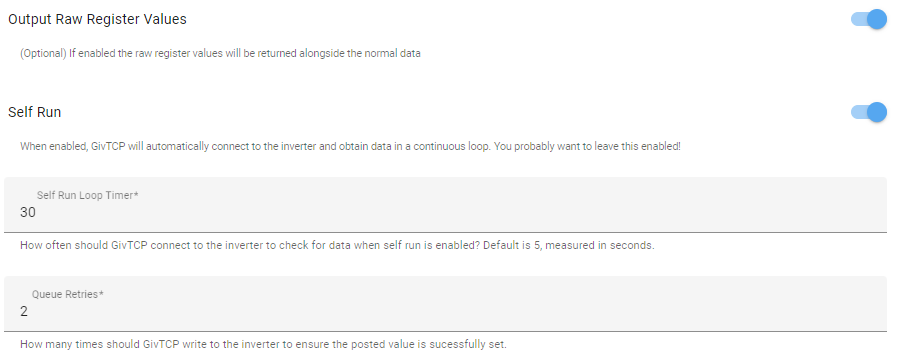
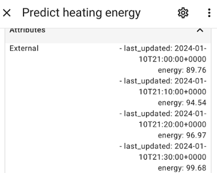

# apps.yaml settings

The basic configuration for Predbat is configured in the `apps.yaml` file.

Depending on whether you have used the [combined AppDaemon/Predbat add-on installation method](install.md#appdaemon-predbat-combined-install) or the
[HACS, Appdaemon add-on then Predbat installation method](install.md#predbat-installation-into-appdaemon), the `apps.yaml` file will be held in one of two directories in Home Assistant:

- `/addon_configs/46f69597_appdaemon-predbat/apps` if you used the combined AppDaemon/Predbat add-on installation method

or

- `/config/appdaemon/apps/batpred/config/` if you used the HACS, AppDaemon add-on then Predbat installation method

You will need to use a file editor within Home Assistant (e.g. either the File editor or Studio Code Server add-on's)
to edit the `apps.yaml` file - see [editing configuration files within Home Assistant](install.md#editing-configuration-files-in-home-assistant) if you need to install an editor.

This section of the documentation describes what the different configuration items in `apps.yaml` do.

When you edit `apps.yaml`, AppDaemon will automatically detect the change and Predbat will be reloaded with the updated file.
You don't need to restart the AppDaemon add-on for your edits to take effect.

## Templates

You can find template configurations in the following location: <https://github.com/springfall2008/batpred/tree/main/templates>

The GivEnergy GivTCP template will be installed by default but if you are using another inverter please copy the correct template into the directory
where your `apps.yaml` is stored, and modify it from there.

Please read: [Other Inverters](other-inverters.md) for non Givenergy inverters

## Basics

Basic configuration items

### prefix

Set to the prefix name to be used for all entities that predbat creates in Home Assistant. Default 'predbat'. Unlikely that you will need to change this.

```yaml
  prefix: predbat
```

### timezone

Set to your local timezone, default is Europe/London. It must be set to a
[valid Python time zone for your location](https://gist.github.com/heyalexej/8bf688fd67d7199be4a1682b3eec7568)

```yaml
  timezone: Europe/London
```

### currency_symbols

Sets your symbol to use for your main currency e.g. £ or $ and for 1/100th unit e.g. p or c

```yaml
 currency_symbols:
   - '£'
   - 'p'
```

### template

Initially set to True, this is used to stop Predbat from operating until you have finished configuring your apps.yaml.
Once you have made all other required changes to apps.yaml this line should be deleted or commented out.

```yaml
#  template: True
```

### threads

If defined sets the number of threads to use during plan calculation, the default is 'auto' which will use the same number of threads as
you have CPUs in your system.
Valid values are:
    - 'auto' - Use the same number of threads as your CPU count
    - '0' - Don't use threads - disabled
    - 'N' - Use N threads, recommended values are between 2 and 8

```yaml
  threads: auto
```

### notify_devices

A list of device names to notify when Predbat sends a notification. The default is just 'notify' which contacts all mobile devices

```yaml
  notify_devices:
    - mobile_app_treforsiphone12_2
```

### days_previous

Predbat needs to know what your likely future house load will be to set and manage the battery level to support it.
days_previous defines a list (which has to be entered as one entry per line) of the previous days of historical house load that are to be used to predict your future daily load.<BR>
It's recommended that you set days_previous so Predbat calculates an average house load using sufficient days' history so that 'unusual' load activity
(e.g. saving sessions, "big washing day", etc) get averaged out.

For example, if you just want Predbat to assume the house load on a particular day is the same as the same day of last week:

```yaml
  days_previous:
    - 7
```

Or if you want Predbat to take the average of the same day for the last two weeks:

```yaml
  days_previous:
    - 7
    - 14
```

Further details and worked examples of [how days_previous works](#understanding-how-days_previous-works) are covered at the end of this document.

Do keep in mind that Home Assistant only keeps 10 days history by default, so if you want to access more than this for Predbat you might need to increase the number of days history
kept in HA before it is purged by editing and adding the following to the `/homeassistant/configuration.yaml` configuration file and restarting Home Assistant afterwards:

```yaml
  recorder:
    purge_keep_days: 14
```

**days_previous_weight** - A list (again with one entry per line) of weightings to be applied to each of the days in days_previous.

For example, to apply a 100% weighting for the first day entry in days_previous, but only a 50% weighting to the second day in days_previous:

```yaml
  days_previous_weight:
    - 1
    - 0.5
```

The default value is 1, that all history days are equally weighted, so if you don't want to weight individual days you can simply use:

```yaml
  days_previous_weight:
    - 1
```

### forecast_hours

the number of hours that Predbat will forecast ahead, 48 is the suggested amount, although other values can be used
such as 30 or 36 if you have a small battery and thus don't need to forecast 2 days ahead.

```yaml
  forecast_hours: 48
```

## Inverter information

The template `apps.yaml` comes pre-configured with regular expressions that should auto-discover the GivTCP Home Assistant entity names.
If you have more than one inverter or entity names are non-standard then you will need to edit apps.yaml for your inverter entities.
For other inverter brands, see [Other Inverters](other-inverters.md)

### num_inverters

The number of inverters you have. If you increase this above 1 you must provide multiple of each of the inverter entities

```yaml
  num_inverters: 1
```

### geserial

Only for GE inverters, this is a helper regular expression to find your serial number, if it doesn't work edit it manually or change individual entities to match.
If you  have more than one inverter you will need one per inverter to be used in the later configuration lines

```yaml
  geserial: 're:sensor.givtcp_(.+)_soc_kwh'
  geserial2: 're:sensor.givtcp2_(.+)_soc_kwh'
```

## Historical data

Predbat can either get historical data (house load, import, export and PV generation) directly from GivTCP or it can obtain it from the GivEnergy cloud.
Unless you have a specific reason to not use the GivTCP data (e.g. you've lost your GivTCP data), its recommended to use GivTCP.

### Data from Home assistant

The following configuration entries in `apps.yaml` are pre-configured to automatically use the appropriate sensors.

If you have a 3-phase electricity supply and one inverter (and battery) on each phase then you will need to add one line for the load, import, export and PV sensors
for each of the 3 phases.

If you have a single phase electricity supply and multiple inverters on the phase then you will need to add one line for each of the load and PV sensors.
You don't need multiple lines for the import or export sensors as each inverter will give the total import or export information.

Edit if necessary if you have non-standard sensor names:

- **load_today** - Entity name for the house load in kWh today (must be incrementing)
- **import_today** - Imported energy today in kWh (incrementing)
- **export_today** - Exported energy today in kWh (incrementing)
- **pv_today** - PV energy today in kWh (incrementing). If you have multiple inverters, enter each inverter PV sensor on a separate line.<BR>
If you have an AC-coupled inverter then enter the Home Assistant sensor for your PV inverter.<BR>
If you don't have any PV panels, comment or delete this line out of apps.yaml.

See the [Workarounds](#workarounds) section below for configuration settings for scaling these if required.

If you have multiple inverters then you may find that the load_today figures are incorrect as the inverters share the house load between them.
In this circumstance one solution is to create a Home Assistant template helper to calculate house load from {pv generation}+{battery discharge}-{battery charge}+{import}-{export}.

e.g.

```yaml
{{ ( states('sensor.givtcp_XXX_pv_energy_today_kwh')|float(0) + <inverter 2>...
  + states('sensor.givtcp_XXX_battery_discharge_energy_today_kwh')|float(0) + <inverter 2>...
  - states('sensor.givtcp_XXX_battery_charge_energy_today_kwh')|float(0) - <inverter 2>...
  + states('sensor.givtcp_XXX_import_energy_today_kwh')|float(0)
  - states('sensor.givtcp_XXX_export_energy_today_kwh')|float(0) ) | round(1) }}
```

### GivEnergy Cloud Data

If you have an issue with the GivTCP data, Predbat can get the required historical data from the GivEnergy cloud instead. This data is updated every 30 minutes.
Obviously connecting to the cloud is less efficient and means that Predbat will be dependent upon your internet connection and the GivEnergy cloud to operate.

- **ge_cloud_data** - When True Predbat will use the GE Cloud for data rather than load_today, import_today and export_today
- **ge_cloud_serial** - Set the inverter serial number to use for the Cloud data
- **ge_cloud_key** - Set to your API Key for the GE Cloud (long string)

## Load filtering

By default if Predbat sees a gap in the historical load data it will fill it with average data. This is to help in the cases of small amounts of lost data.
For entire lost days you should change **days_previous** to point to different days(s) or include 3 or more days and if you set **switch.predbat_load_filter_modal** to true,
the lowest day's historical load will be discarded.

- **load_filter_threshold** - Sets the number of minutes of zero load data to be considered a gap (that's filled with average data), the default is 30.
To disable, set it to 1440.

## Inverter control configurations

- **inverter_limit** - One per inverter. When set defines the maximum watts of AC output power for your inverter (e.g. 3600).
This will help to emulate clipping when your solar produces more than the inverter can handle, but it won't be that accurate as the source of the data isn't minute by minute.
If you have a separate Solar inverter as well then add the solar inverter limit to the battery inverter limit to give one total amount.

- **export_limit** - One per inverter (optional). When set defines the maximum watts of AC power your inverter can export to the grid at (e.g. 2500).
This will emulate the software export limit setting in the Inverter that you will have if your G98/G99
approval was lower than your maximum inverter power (check your install information for details).
If you do not set an export limit then it's the same as the inverter limit.

- **inverter_limit_charge** and **inverter_limit_discharge** - One per inverter (optional). When set in watts, overrides the maximum
charge/discharge rate settings used when controlling the inverter.
This can be used if you need to cap your inverter battery rate (e.g. charge overnight at a slower rate to reduce inverter/battery heating) as Predbat
will normally configure all timed charges or discharges to be at the inverter's maximum rate.

## Controlling the Inverter

There are two ways that Predbat can control GivTCP to control the inverter, either via REST API calls (preferred) or via the GivTCP inverter controls in Home Assistant.

### REST Interface inverter control

- **givtcp_rest** - One per Inverter, sets the GivTCP REST API URL ([http://homeassistant.local:6345](http://homeassistant.local:6345)
is the normal one for the first inverter and :6346 for the second inverter).
When enabled the Control per inverter below isn't used and instead communication from Predbat to GivTCP is directly via REST and thus bypasses some issues with MQTT.
If using Docker then change homeassistant.local to the Docker IP address.

To check your REST is working open up the readData API point in a Web browser e.g: [http://homeassistant.local:6345/readData](http://homeassistant.local:6345/readData)

If you get a bunch of inverter information back then it's working!

*TIP:* It's recommended you enable 'Output Raw Register Values' in GivTCP (via Settings / Add-on's / GivTCP / configuration tab) for added monitoring,
and set the Self Run Loop Timer which controls how often GivTCP retrieves data from your inverters to a value between 20 and 60 seconds.
Do not set Self Run to too low a value (i.e. retrieve too often) as this may overload the inverter:



### Home Assistant inverter control

As an alternative to REST control, Predbat can control the GivEnergy inverters via GivTCP controls in Home Assistant.
The template `apps.yaml` is pre-configured with regular expressions for the following configuration items that should auto-discover the GivTCP controls,
but may need changing if you have multiple inverters or non-standard GivTCP entity names.

The **givtcp_rest** line should be commented out/deleted in order for Predbat to use the direct GivTCP Home Assistant controls.

- **charge_rate** - GivTCP battery charge rate entity in watts
- **discharge_rate** - GivTCP battery discharge max rate entity in watts
- **battery_power** - GivTCP current battery power in watts
- **pv_power** - GivTCP current PV power in watts
- **load_power** - GivTCP current load power in watts
- **soc_kw** - GivTCP Entity name of the battery SOC in kWh, should be the inverter one not an individual battery
- **soc_max** - GivTCP Entity name for the maximum charge level for the battery
- **reserve** - GivTCP sensor name for the reserve setting in %
- **inverter_mode** - GivTCP inverter mode control
- **inverter_time** - GivTCP inverter timestamp
- **charge_start_time** - GivTCP battery charge start time entity
- **charge_end_time** - GivTCP battery charge end time entity
- **charge_limit** - GivTCP Entity name for used to set the SOC target for the battery in percentage
- **scheduled_charge_enable** - GivTCP Scheduled charge enable config
- **scheduled_discharge_enable** - GivTCP Scheduled discharge enable config
- **discharge_start_time** - GivTCP scheduled discharge slot_1 start time
- **discharge_end_time** - GivTCP scheduled discharge slot_1 end time

If you are using REST control the above GivTCP configuration items can be deleted or commented out of `apps.yaml`
(but see section below on [creating the battery charge power curve](#workarounds)).

## Solcast Solar Forecast

As described in the [Predbat installation instructions](install.md#solcast-install), Predbat needs a solar forecast
in order to predict solar generation and battery charging which can be provided by the Solcast integration.

The template `apps.yaml` is pre-configured with regular expressions for the following configuration items that should auto-discover the Solcast entity names.
They are unlikely to need changing although a few people have reported their entity names don't contain 'solcast' so worth checking, or edit if you have non-standard names:

- **pv_forecast_today** - Entity name for today's Solcast forecast
- **pv_forecast_tomorrow** - Entity name for tomorrow's Solcast's forecast
- **pv_forecast_d3** - Entity name for Solcast's forecast for day 3
- **pv_forecast_d4** - Entity name for Solcast's forecast for day 4 (also d5, d6 & d7 are supported, but not that useful)

If you do not have a PV array then comment out or delete these Solcast lines from `apps.yaml`.

If you have multiple PV arrays connected to GivEnergy Hybrid inverters or you have GivEnergy AC-coupled inverters, then ensure your PV configuration in Solcast covers all arrays.

If however you have a mixed PV array setup with some PV that does not feed into your GivEnergy inverters
(e.g. hybrid GE inverters but a separate older FIT array that directly feeds AC into the house),
then it's recommended that Solcast is only configured for the PV connected to the GivEnergy inverters.

Solcast produces 3 forecasted PV estimates, the 'central' (50% or most likely to occur) PV forecast, the '10%' (worst case) PV forecast, and the '90%' (best case) PV forecast.<BR>
By default Predbat will use the central estimate and applies to it the **input_number.predbat_pv_metric10_weight** weighting of the 10% (worst case) estimate.

Predbat models cloud coverage by using the difference between the PV and PV10 forecasts to work out a cloud factor,
this modulates the PV output predictions up and down accordingly as if there were passing clouds.
This can have an impact on planning, especially for things like freeze charging which could assume the PV will cover the house load but it might not due to clouds.

- **pv_estimate** in `apps.yaml` can be used to configure Predbat to always use the 10% forecast by setting the configuration item to '10',
or '90' to always use the 90% PV estimate (not recommended!).<BR>
Set to blank or delete / comment out the line to use the default central estimate.

If **pv_estimate** is set to 10 then **input_number.predbat_pv_metric10_weight** in Home Assistant should be set to 1.0.

## Energy Rates

There are a number of configuration items in `apps.yaml` for telling Predbat what your import and export rates are.

These are described in detail in [Energy Rates](energy-rates.md) and are listed here just for completeness:

- **metric_octopus_import** - Import rates from the Octopus Energy integration
- **metric_octopus_export** - Export rates from the Octopus Energy integration
- **metric_octopus_gas** - Gas rates from the Octopus Energy integration
- **octopus_intelligent_slot** - Octopus Intelligent GO slot sensor from the Octopus Energy integration
- **octopus_saving_session** - Energy saving sessions sensor from the Octopus Energy integration
- **octopus_saving_session_octopoints_per_penny** - Sets the Octopoints per pence
- **rates_import_octopus_url** - Octopus pricing URL (over-rides metric_octopus_import)
- **rates_export_octopus_url** - Octopus export pricing URL (over-rides metric_octopus_export)
- **metric_standing_charge** - Standing charge in pounds
- **rates_import** - Import rates over a 24-hour period with start and end times
- **rates_export** - Export rates over a 24-hour period with start and end times
- **rates_import_override** - Over-ride import rate for specific date and time range, e.g. Octopus Power-up events
- **rates_export_override** - Over-ride export rate for specific date and time range
- **futurerate_url** - URL of future energy market prices for Agile users
- **futurerate_adjust_import** and **futurerate_adjust_export** - Whether tomorrow's predicted import or export prices should be adjusted based on market prices or not
- **futurerate_peak_start** and **futurerate_peak_end** - start/end times for peak-rate adjustment
- **futurerate_peak_premium_import** and **futurerate_peak_premium_export** - price premium to be added during the peak period

## Car Charging Integration

Predbat is able to include electric vehicle charging in its plan and manage the battery activity so that the battery isn't discharged into your car when the car is charging
(although you can over-ride this if you wish by setting the **switch.predbat_car_charging_from_battery** to True in Home Assistant).

There are two different ways of planning car charging into cheap slots with Predbat, either by the Octopus Energy integration or by Predbat identifying the cheapest slots.
These approaches and the set of settings that need to be configured together are described in [Car Charging Planning](car-charge-planning.md).

The full list of car charging configuration items in `apps.yaml` that are used to plan car charging activity within Predbat are described below.
The Home Assistant controls (switches, input numbers, selectors, etc) related to car charging are described in [Car Charging configuration within Home Assistant](customisation.md#car-charging),
with brief mention of pertinent controls included here alongside the apps.yaml configuration items where relevant for context.

- **num_cars** should be set in apps.yaml to the number of cars you want Predbat to plan for.
Set to 0 if you don't have an EV (and the remaining car sensors in apps.yaml can safely be commented out or deleted as they won't be required).

### Car Charging Filtering

You might want to remove your electric car charging data from the historical house load data so as to not bias the calculations, otherwise you will get
high battery charge levels when the car was charged previously (e.g. last week).

- **switch.predbat_car_charging_hold** - A Home Assistant switch that when turned on (True) tells Predbat to remove car charging data from your historical house load
so that Predbat's battery prediction plan is not distorted by previous car charging.

- **car_charging_energy** - Set in `apps.yaml` to point to a Home Assistant entity which is the incrementing kWh data for the car charger.
This has been pre-defined to a regular expression that should auto-detect the appropriate Wallbox and Zappi car charger sensors,
or edit as necessary in `apps.yaml` for your charger sensor.<BR>
This can be set to a list of car charging energy sensors, one per line if you have multiple EV car chargers.<BR>
*TIP:* You can also use **car_charging_energy** to remove other house load kWh from the data Predbat uses for the forecast,
e.g. if you want to remove Mixergy hot water tank heating data from the forecast such as if you sometimes heat on gas, and sometimes electric depending upon import rates.

- **input_number.predbat_car_charging_energy_scale** - A Home Assistant entity used to define a scaling factor (in the range 0.1 to 1.0)
to multiply the car_charging_energy data by if required (e.g. set to 0.001 to convert Watts to kW).

If you do not have a suitable car charging kWh sensor in Home Assistant then comment the car_charging_energy line out of `apps.yaml` and configure the following Home Assistant entity:

- **input_number.predbat_car_charging_threshold** - Sets the threshold above which home consumption is assumed to be car charging and
will be removed from the home load data (default 6 = 6kW).

### Planned Car Charging

These features allow Predbat to know when you plan to charge your car.

If you have Intelligent Octopus setup then planning of charging is done via the Octopus app and Predbat obtains this information through the Octopus Energy integration in Home Assistant.

- **switch.predbat_octopus_intelligent_charging** - When this Home Assistant switch is enabled, Predbat will plan charging around the Intelligent Octopus slots, taking
it into account for battery load and generating the slot information

The following `apps.yaml` configuration items are pre-defined with regular expressions to point to appropriate sensors in the Octopus Energy integration.
You should not normally need to change these if you have Octopus Intelligent:

- **octopus_intelligent_slot** - Points to the Octopus Energy integration 'intelligent dispatching' sensor that indicates
whether you are within an Octopus Energy "smart charge" slot, and provides the list of future planned charging activity.

- **octopus_ready_time** - Points to the Octopus Energy integration sensor that details when the car charging will be completed by.

- **octopus_charge_limit** - Points to the Octopus Energy integration sensor that provides the car charging limit.

If you don't use Intelligent Octopus then the above 3 Octopus Intelligent configuration lines in `apps.yaml` can be commented out or deleted,
and there are a number of other apps.yaml configuration items that should be set:

- **car_charging_planned** - Optional, can be set to a Home Assistant sensor (e.g. from your car charger integration)
which lets Predbat know the car is plugged in and planned to charge during low rate slots.
Or manually set it to 'False' to disable this feature, or 'True' to always enable.<BR>
The `apps.yaml` template supplied with Predbat comes pre-configured with a regular expression that should automatically match Zappi or Wallbox car chargers.
If you have a different type of charger you will need to configure it manually.

- **car_charging_planned_response** - An array of values for the above car_charging_planned sensor which indicate that the car is plugged in and will charge in the next low rate slot.
The template `apps.yaml` comes with a set of pre-defined sensor values that should match most EV chargers.
Customise for your car charger sensor if it sets sensor values that are not in the list.

- **car_charging_now** - For some cases finding details of planned car charging is difficult to obtain (e.g. Ohme with Intelligent doesn't report slots).<BR>
The car_charging_now configuration item can be set to point to a Home Assistant sensor that tells you that the car is currently charging.
Predbat will then assume this 30 minute slot is used for charging regardless of the plan.<BR>
If Octopus Intelligent Charging is enabled and car_charging_now indicates the car is charging then Predbat will also assume that this is a
low rate slot for the car/house (and might therefore start charging the battery), otherwise electricity import rates are taken from the normal rate data.

- **car_charging_now_response** - Set to the range of positive responses for car_charging_now to indicate that the car is charging.
Useful if you have a sensor for your car charger that isn't binary.

To make planned car charging more accurate, configure the following items in `apps.yaml`:

- **car_charging_battery_size** - Set this value in `apps.yaml` to the car's battery size in kWh. If not set, Predbat defaults to 100. It will be used to predict car charging stops.

- **car_charging_limit** - You should configure this to point to a sensor that specifies the % limit the car is set to charge to.
This could be a sensor on the EV charger integration or a Home Assistant helper entity you can set as you wish.
If you don't specify a sensor Predbat will default to 100%.

- **car_charging_soc** - You should configure this to point to a sensor (on the HA integration for your EV charger) that specifies the car's current % charge level.
If not set, Predbat will default to 0%.

### Multiple Electric Cars

Multiple cars can be planned with Predbat, in which case you should set **num_cars** in `apps.yaml` to the number of cars you want to plan

- **car_charging_limit**, **car_charging_planned**, **car_charging_battery_size** and **car_charging_soc** must then be a list of values (i.e. 2 entries for 2 cars)

- If you have Intelligent Octopus then Car 0 will be managed by the Octopus Energy integration, if its enabled

- Each car will have it's own Home Assistant slot sensor created e.g. **binary_sensor.predbat_car_charging_slot_1**,
SOC planning sensor e.g **predbat.car_soc_1** and **predbat.car_soc_best_1** for car 1

## Load Forecast

In addition to the historical house load data that Predbat uses by default, you can optionally provide a forecast of future load
such as is produced by [Predheat for Hot water and Heat Pump heating systems](https://github.com/springfall2008/predheat) or via [Predai](https://github.com/springfall2008/predai)

- **load_forecast** - this should be configured to point to a sensor and attribute. The attribute must in either
    - The format of 'last_updated' timestamp and 'energy' in incrementing kWh.
    - The format of a dictionary of timestamps and energy data in incremental KWh.

For example:<BR>


Or


`apps.yaml` should be configured to point to the forecast sensor and attribute (in the above formats) like this:

```yaml
load_forecast:
  - sensor_name$attribute_name
```

So if using Predheat it would be configured as:

```yaml
load_forecast:
  - predheat.heat_energy$external
```

Set **load_forecast_only** to True if you do not wish to use the Predbat forecast but instead want to use this as your only forecast data e.g using PredAi:

```yaml
  load_forecast_only: True
  load_forecast:
     - sensor.givtcp_{geserial}_load_energy_today_kwh_prediction$results
```

## Balance Inverters

When you have two or more inverters it's possible they get out of sync so they are at different charge levels or they start to cross-charge (one discharges into another).
When enabled, balance inverters tries to recover this situation by disabling either charging or discharging from one of the batteries until they re-align.

Most of the Predbat configuration for balancing inverters is through a number of [Home Assistant controls for Balancing Inverters](customisation.md#balance-inverters),
but there is one configuration item in `apps.yaml`:

```yaml
  balance_inverters_seconds: seconds
```

Defines how often to run the inverter balancing, 30 seconds is recommended if your machine is fast enough, but the default is 60 seconds.

## Workarounds

There are a number of different configuration items in `apps.yaml` that can be used to tweak the way Predbat operates and workaround
weirdness you may have from your inverter and battery setup.

### Clock skew

```yaml
  clock_skew: minutes
```

Skews the local (computer) time that Predbat uses (from AppDaemon).<BR>
Set to 1 means add a minute to the AppDaemon time, set to -1 means take a minute off the AppDaemon time.
This will change when real-time actions happen e.g. triggering a charge or discharge.

If your inverter's time is different to the time on the computer running Home Assistant, you may need to skew the time settings made on the inverter when you trigger charging or discharging.
Again 1 means the inverter is 1 minute fast and -1 means the inverter is 1 minute slow.

Separate start and end options are applied to the start and end time windows, mostly as you want to start battery activity late (not early) and finish early (not late).

You can adjust the charge and discharge times written to the inverter by setting the following in `apps.yaml`:

```yaml
  inverter_clock_skew_start: minutes
  inverter_clock_skew_end: minutes
```

Skews the setting of the charge slot registers vs the predicted start time

```yaml
  inverter_clock_skew_discharge_start: minutes
  inverter_clock_skew_discharge_end: minutes
```

Skews the setting of the discharge slot registers vs the predicted start time

### Battery size scaling

```yaml
  battery_scaling: scale
```

Default value 1.0. One per inverter.

This setting is used to scale the battery reported SOC kWh to make it appear bigger or larger than it is.<BR>
*TIP:* If you have a GivEnergy 2.6 or 5.2kWh battery then it will have an 80% depth of discharge but it will falsely report its capacity as being the 100% size,
so set battery_scaling to 0.8 to report the correct usable capacity figure to Predbat.<BR>
*TIP:* Likewise if you have a GivEnergy All in One, it will incorrectly report the 13.5kWh usable capacity as 15.9kWh, so set battery_scaling to 0.85 to correct this.<BR>
If you are going chart your battery SoC in Home Assistant then you may want to use **predbat.soc_kw_h0** as your current SoC
rather than the usual *givtcp_<serial_number>_soc* GivTCP entity so everything lines up

### Import export scaling

```yaml
  import_export_scaling: scale
```

Default value 1.0. Used to scale the import & export kWh data from GivTCP if the inverter information is incorrect.

### Inverter rate minimum

```yaml
  inverter_battery_rate_min: watts
```

One per inverter (optional), set in Watts, when set models a "bug" in the inverter firmware
in some models where if charge or discharge rates are set to 0 you actually get a small amount of charge or discharge.
Recommended setting is 200 for Gen 1 hybrids with this issue.

### Inverter reserve maximum

```yaml
  inverter_reserve_max: percent
```

Global, sets the maximum reserve % that may be set to the inverter, the default is 98, as some Gen 2 & Gen 3 inverters and
AIO firmware versions refuse to be set to 100.  Comment the line out or set to 100 if your inverter allows setting to 100%.

## Automatic restarts

If the add-on that is providing the inverter control stops functioning it can prevent Predbat from functioning correctly. In this case you can tell Predbat
how to restart the add-on using a service.

Right now only communication loss with GE inverters is detectable but in future other systems will be supported.

When enabled if communication is lost then the service configured will be triggered and can cause a restart which may restart the connection.
This maybe useful with GivTCP if you have time sync errors or lost of REST service every now and again.

The auto_restart itself is a list of commands to run to trigger a restart.

- The **shell** command will call a 'sh' shell and can be used to delete files and suchlike.
- The **service** command is used to call a service, and can contain arguments of **addon** and/or **entity_id**

```yaml
auto_restart:
  - shell: 'rm -rf /homeassistant/GivTCP/*.pkl'
  - service: hassio/addon_restart
    addon: a6a2857d_givtcp
```

## Battery charge/discharge curves

- **battery_charge_power_curve** - Some batteries tail off their charge rate at high soc% and this optional configuration item enables you to model this in Predbat.
Enter the charging curve as a series of steps of % of max charge rate for each soc percentage.

The default is 1.0 (full power) charge all the way to 100%.

Modelling the charge curve becomes important if you have limited charging slots (e.g. only a few hours a night) or you wish to make accurate use of the
low power charging mode (**switch.predbat_set_charge_low_power**).

Predbat can now automatically calculate the charging curve for you if you have enough suitable historical data in Home Assistant. The charging curve will be calculated
when battery_charge_power_curve option is *not* set in apps.yaml and Predbat performs an initial run (e.g. due to restarting AppDaemon or an edit being made to apps.yaml).
You should look at the [AppDaemon/Predbat logfile](output-data.md#predbat-logfile) to find the predicted battery charging curve and copy/paste it into your `apps.yaml` file.
This will also include a recommendation for how to set your **battery_rate_max_scaling** setting in HA.

The YouTube video [charging curve and low power charging](https://youtu.be/L2vY_Vj6pQg?si=0ZiIVrDLHkeDCx7h)
explains how the curve works and shows how Predbat automatically creates it.

Setting this option to **auto** will cause the computed curve to be stored and used automatically. This is not recommended if you use low power charging mode as your
history will eventually not contain any full power charging data to compute the curve, so in this case it's best to manually save the data.

NB: In order for Predbat to have calculate your charging curve it needs to have access to historical Home Assistant data for battery_charge_rate, battery_power and soc_kw.

If you are using the recommended default [REST mode to control your inverter](#inverter-control-configurations) then you will need to uncomment out the following entries in `apps.yaml`:

```yaml
  charge_rate:
    - number.givtcp_{geserial}_battery_charge_rate
  battery_power:
    - sensor.givtcp_{geserial}_battery_power
  soc_kw:
    - sensor.givtcp_{geserial}_soc_kwh
```

Once the battery charge curve has been created these entries can be commented out again in `apps.yaml`.

Example charging curve from a GivEnergy 9.5kWh battery with latest firmware and Gen 1 inverter:

```yaml
  battery_charge_power_curve:
    91 : 0.91
    92 : 0.81
    93 : 0.71
    94 : 0.62
    95 : 0.52
    96 : 0.43
    97 : 0.33
    98 : 0.24
    99 : 0.24
    100 : 0.24
```

- **battery_discharge_power_curve** - Some batteries tail off their discharge rate at low soc% and this optional configuration item enables you to model this in Predbat.

Enter the charging curve as a series of steps of % of max charge rate for each soc percentage.

The default is 1.0 (full power) discharge all the way to 0%.

You can also look at the automation power curve calculation in the AppDaemon/Predbat log when Predbat starts (when this option is not set).

Setting This option to **auto** will cause the computed curve to be stored and used automatically. This may not work very well if you don't do regular discharges to empty
the battery.

In the same way as for the battery charge curve above, Predbat needs to have access to historical Home Assistant data for battery_discharge_rate, battery_power and soc_kw.

If you are using REST mode to control your inverter then the following entries in `apps.yaml` will need to be uncommented :

```yaml
  discharge_rate:
    - number.givtcp_{geserial}_battery_discharge_rate
  battery_power:
    - sensor.givtcp_{geserial}_battery_power
  soc_kw:
    - sensor.givtcp_{geserial}_soc_kwh
```

## Triggers

The trigger feature is useful to help trigger your own automations based on Predbat determining that you have spare solar energy or battery that you would otherwise export.
For example you may turn an immersion heater or the washing machine on to consume the excess solar power.

The triggers count export energy until the next active charge slot only.

For each trigger give a name, the minutes of export needed and the energy required in that time.

Multiple triggers can be set at once so in total you could use too much energy if all run.

Each trigger specified in `apps.yaml` will create a Home Assistant entity called 'binary_sensor.predbat_export_trigger_*name*' which will be turned on when the condition is valid.
Connect this binary sensor to your automation to start whatever you want to trigger.

Set the name for each trigger, the number of minutes of solar export you need, and the amount of energy in kWh you will need available during that time period in apps.yaml:

For example:

```yaml
export_triggers:
  - name: "large"
    minutes: 60
    energy: 1.0
  - name: "small"
    minutes: 15
    energy: 0.25
```

If you wish to trigger based on charging or discharging the battery rather than spare solar energy you can instead use the following binary sensors in Home Assistant:

- **binary_sensor.predbat_charging** - Will be True when the home battery is inside a charge slot (either being charged or being held at a level).
Note that this does include charge freeze slots where the discharge rate is set to zero without charging the battery.

- **binary_sensor.predbat_discharging** - Will be True when the home battery is inside a force discharge slot. This does not include
discharge freeze slots where the charge rate is set to zero to export excess solar only.

## Understanding how days_previous works

As described earlier, **days_previous** is a list of the previous days of historical house load that are averaged together to predict your future daily load.

e.g., if you want the average of the same day for the last 2 weeks:

```yaml
  days_previous:
    - 7
    - 14
```

This section describes in more detail how days_previous is used by Predbat in creating the future battery plan, and gives some worked examples and a 'gotcha' to be aware of.

When Predbat forecasts future home demand it counts backwards the days_previous number of days to find the appropriate historical home consumption.
This is best explained through a worked example:

In this example, days_previous is set to use history from 2 days ago:

```yaml
  days_previous:
    - 2
```

If right now today it's Monday 3:15pm and Predbat is predicting the forward plan for the next 48 hours:

- For tomorrow (Tuesday) 9am slot, Predbat will look backwards 2 days from Tuesday so will use the historical home consumption from Sunday 9am
as being the predicted load for Tuesday 9am.
- For the day after (Wednesday) 9am slot, Predbat again looks backwards 2 days from that day, so will use historical home consumption from Monday 9am as being the Wednesday 9am prediction.

This pattern of counting backwards days_previous days to find the appropriate time slot to load historical home consumption from
requires Predbat to operate some additional special processing if days_previous is set to a low value or forecast_hours to a high value.

Extending the previous example but this time days_previous is set to use history from just the previous day:

```yaml
  days_previous:
    - 1
```

Today its still Monday 3:15pm and Predbat is predicting the forward plan for the next 48 hours:

- For tomorrow (Tuesday) 9am slot, Predbat will look backwards 1 day from Tuesday so will use the historical home consumption from today (Monday) 9am
as being the predicted load for Tuesday 9am.
- For the day after (Wednesday) 9am slot, Predbat again looks backwards 1 days from that day,
so looks for historical home consumption from Tuesday 9am as being the Wednesday 9am prediction,
but of course it's still Monday and Tuesday hasn't happened yet so we can't know what that historial consumption was!<BR>
What Predbat does in this circumstance is to subtract a further day from days_previous and for Wednesday 9am's prediction it will therefore use the historical load from Monday 9am.

This issue of finding future historical load only occurs when days_previous is set to 1 and Predbat is forecasting more than 24 hours ahead from 'now'.
So to highlight this with some edge cases, today is still Monday 3:15pm, days_previous is still set to '1' and in the forward plan:

- For tomorrow (Tuesday) 2:30pm slot, Predbat looks backwards 1 day from Tuesday and takes the historical home consumption from today (Monday) 2:30pm slot.
- For tomorrow (Tuesday) 3:00pm slot, Predbat looks backwards 1 day and takes the historical load from today (Monday) 3:00pm slot - which we are only part way through
so only 15 minutes of load will be predicted for tomorrow 3pm.
- For tomorrow (Tuesday) 3:30pm slot, Predbat looks backwards 1 day but the 3:30pm slot today hasn't yet occurred so Predbat will take the historical load from the prior day
and has to use Sunday's 3:30pm load for tomorrow's prediction.
- Ditto the predicted load for tomorrow (Tuesday) 4:00pm slot comes from Sunday 4pm.

Of course as today rolls forward and Predbat keeps on updating the forward plan every 5 minutes the prediction will be updated with the correct previous_day history as and when it exists.

Its recommended therefore that days_previous isn't set to 1, or if it is, that you understand the way this has to work and the consequences.
If you want to set days_previous to take an average of the house load over all the days of the last week its suggested that it be set as:

```yaml
  days_previous:
    - 2
    - 3
    - 4
    - 5
    - 6
    - 7
    - 8
```
