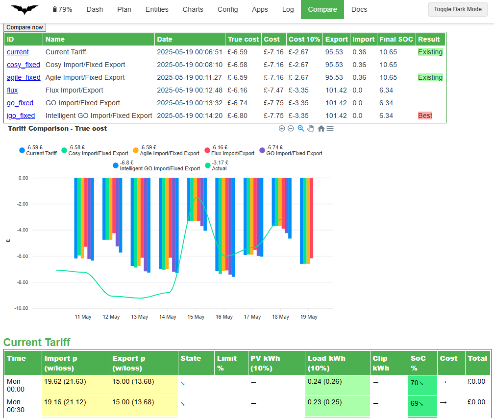

# Comparing Energy Tariffs

While it is quite easy to go off and compare your historical usage against various energy tariffs with existing apps, it is much harder to perform a what-if analysis
as the way you control your battery would be different depending on the tariff.

For this reason, Predbat offers an energy rate comparison to allow you to know if you are on the best available tariff or when it might be time to switch.

Once you have given Predbat a list of tariffs that you want to compare then it will update its predictions daily and keep a history of these over time.

If you do decide to switch to Octopus Energy after using this feature please consider using my referral link so we can both save some money: <https://share.octopus.energy/jolly-eel-176>

Its recommended to watch the [YouTube video on Energy tariff comparison](https://youtu.be/qOG7nxHJKaE) as this explains the feature in more detail and what the different columns of the comparison mean.

## Limitations

Keep in mind this is an approximation of costs for the following 24-hour period and the reality could be different. In particular, car charging costs are unlikely to reflect the true picture as it will only be planned after you plug in.
Smart tariffs like Octopus Intelligent Go can give you extra cheap car slots, and Octopus Intelligent Flux where Octopus controls the charging/discharging, mean these tariffs cannot be predicted as accurately.
When changing tariffs, you should use your judgment, the Predbat Compare data is only a helpful guide.

## Configuring the tariff's to compare

First, you need to tell Predbat in apps.yaml which tariffs you want to compare, you should list all the tariffs you realistically might want to switch between, including your current tariff to act as a baseline.

Below is a suggestion of various Octopus tariff combinations (valid October 2025) against region A.
You will need to change **dno_region** to match your region code if you decide to use this template - see list of [Electricity region codes](https://energy-stats.uk/dno-region-codes-explained/).

From time to time Octopus change and withdraw their tariffs so the URL's the compare function uses might stop working.<BR>
A full list of available Octopus products is at <https://api.octopus.energy/v1/products/>.

If you view this page, search for the tariff by name, then copy the URL it shows into a new tab.

E.g. <https://api.octopus.energy/v1/products/GO-VAR-22-10-14/>

Look through that page to find the right URL for usage charges in your DNO area

<https://api.octopus.energy/v1/products/GO-VAR-22-10-14/electricity-tariffs/E-1R-GO-VAR-22-10-14-A/standard-unit-rates>

(For area A)

As well as Octopus rate URLs (rates_import_octopus_url/rates_export_octopus_url) you can use manual rates (rates_import/rates_export),
Octopus integration rates (metric_octopus_import/metric_octopus_export) and Energi Data service rates (metric_energidataservice_import/metric_energidataservice_export).

Each tariff must be given an ID which will be used to create a sensor to track predicted cost over time, the full name is used in the description of that sensor and on the web page.
The ID can contain alphanumeric characters or underscores; do not use slashes, commas, spaces or other special characters in the ID or predbat will crash when running the compare!

If you do not set an import or export rate for a particular tariff then your existing energy rates will be used.

```yaml
  # Tariff comparison feature
  #
  # Adjust this list to the tariffs you want to compare, include your current tariff also
  # DNO region code (see https://energy-stats.uk/dno-region-codes-explained/)
  dno_region: "A"
  compare_list:
    - id: 'current'
      name: 'Current Tariff'
    - id: 'cap_seg'
      name: 'Price cap import/SEG export'
      rates_import:
        - rate: 24.86
      rates_export:
        - rate: 4.1
    - id: 'eon_next_drive'
      name: 'Eon Next Drive import/Fixed export'
      rates_import:
        - rate: 6.7
          start: "00:00:00"
          end: "07:00:00"
        - rate: 24.86
          start: "07:00:00"
          end: "00:00:00"
      rates_export:
        - rate: 16.5
    - id: 'igo_fixed'
      name: 'Intelligent GO import/Fixed export'
      rates_import_octopus_url: 'https://api.octopus.energy/v1/products/INTELLI-VAR-24-10-29/electricity-tariffs/E-1R-INTELLI-VAR-24-10-29-{dno_region}/standard-unit-rates/'
      rates_export_octopus_url: 'https://api.octopus.energy/v1/products/OUTGOING-VAR-24-10-26/electricity-tariffs/E-1R-OUTGOING-VAR-24-10-26-{dno_region}/standard-unit-rates/'
    - id: 'igo_agile'
      name: 'Intelligent GO import/Agile export'
      rates_import_octopus_url: 'https://api.octopus.energy/v1/products/INTELLI-VAR-24-10-29/electricity-tariffs/E-1R-INTELLI-VAR-24-10-29-{dno_region}/standard-unit-rates/'
      rates_export_octopus_url: 'https://api.octopus.energy/v1/products/AGILE-OUTGOING-19-05-13/electricity-tariffs/E-1R-AGILE-OUTGOING-19-05-13-{dno_region}/standard-unit-rates/'
    - id: 'go_fixed'
      name: 'GO import/Fixed export'
      rates_import_octopus_url: 'https://api.octopus.energy/v1/products/GO-VAR-22-10-14/electricity-tariffs/E-1R-GO-VAR-22-10-14-{dno_region}/standard-unit-rates/'
      rates_export_octopus_url: 'https://api.octopus.energy/v1/products/OUTGOING-VAR-24-10-26/electricity-tariffs/E-1R-OUTGOING-VAR-24-10-26-{dno_region}/standard-unit-rates/'
    - id: 'go_agile'
      name: 'GO import/Agile export'
      rates_import_octopus_url: 'https://api.octopus.energy/v1/products/GO-VAR-22-10-14/electricity-tariffs/E-1R-GO-VAR-22-10-14-{dno_region}/standard-unit-rates/'
      rates_export_octopus_url: 'https://api.octopus.energy/v1/products/AGILE-OUTGOING-19-05-13/electricity-tariffs/E-1R-AGILE-OUTGOING-19-05-13-{dno_region}/standard-unit-rates/'
    - id: 'agile_fixed'
      name: 'Agile import/Fixed export'
      rates_import_octopus_url: 'https://api.octopus.energy/v1/products/AGILE-24-10-01/electricity-tariffs/E-1R-AGILE-24-10-01-{dno_region}/standard-unit-rates/'
      rates_export_octopus_url: 'https://api.octopus.energy/v1/products/OUTGOING-VAR-24-10-26/electricity-tariffs/E-1R-OUTGOING-VAR-24-10-26-{dno_region}/standard-unit-rates/'
    - id: 'agile_agile'
      name: 'Agile import/Agile export'
      rates_import_octopus_url: 'https://api.octopus.energy/v1/products/AGILE-24-10-01/electricity-tariffs/E-1R-AGILE-24-10-01-{dno_region}/standard-unit-rates/'
      rates_export_octopus_url: 'https://api.octopus.energy/v1/products/AGILE-OUTGOING-19-05-13/electricity-tariffs/E-1R-AGILE-OUTGOING-19-05-13-{dno_region}/standard-unit-rates/'
    - id: 'flux'
      name: 'Flux import/Export'
      rates_import_octopus_url: 'https://api.octopus.energy/v1/products/FLUX-IMPORT-23-02-14/electricity-tariffs/E-1R-FLUX-IMPORT-23-02-14-{dno_region}/standard-unit-rates'
      rates_export_octopus_url: 'https://api.octopus.energy/v1/products/FLUX-EXPORT-23-02-14/electricity-tariffs/E-1R-FLUX-EXPORT-23-02-14-{dno_region}/standard-unit-rates'
    - id: 'cosy_fixed'
      name: 'Cosy import/Fixed export'
      rates_import_octopus_url: 'https://api.octopus.energy/v1/products/COSY-22-12-08/electricity-tariffs/E-1R-COSY-22-12-08-{dno_region}/standard-unit-rates'
      rates_export_octopus_url: 'https://api.octopus.energy/v1/products/OUTGOING-VAR-24-10-26/electricity-tariffs/E-1R-OUTGOING-VAR-24-10-26-{dno_region}/standard-unit-rates/'
    - id: 'cosy_agile'
      name: 'Cosy import/Agile export'
      rates_import_octopus_url: 'https://api.octopus.energy/v1/products/COSY-22-12-08/electricity-tariffs/E-1R-COSY-22-12-08-{dno_region}/standard-unit-rates'
      rates_export_octopus_url: 'https://api.octopus.energy/v1/products/AGILE-OUTGOING-19-05-13/electricity-tariffs/E-1R-AGILE-OUTGOING-19-05-13-{dno_region}/standard-unit-rates/'
    - id: 'snug_fixed'
      name: 'Snug import/Fixed export'
      rates_import_octopus_url: 'https://api.octopus.energy/v1/products/SNUG-24-11-07/electricity-tariffs/E-1R-SNUG-24-11-07-{dno_region}/standard-unit-rates/'
      rates_export_octopus_url: 'https://api.octopus.energy/v1/products/OUTGOING-VAR-24-10-26/electricity-tariffs/E-1R-OUTGOING-VAR-24-10-26-{dno_region}/standard-unit-rates/'
    - id: 'iflux'
      name: 'Intelligent Flux import/export'
      rates_import_octopus_url: 'https://api.octopus.energy/v1/products/INTELLI-FLUX-IMPORT-23-07-14/electricity-tariffs/E-1R-INTELLI-FLUX-IMPORT-23-07-14-{dno_region}/standard-unit-rates/'
      rates_export_octopus_url: 'https://api.octopus.energy/v1/products/INTELLI-FLUX-EXPORT-23-07-14/electricity-tariffs/E-1R-INTELLI-FLUX-EXPORT-23-07-14-{dno_region}/standard-unit-rates/'
```

## Running a comparison

By default, the comparison will be run at Midnight every night and saved for the entire day.

You can view the comparison on the [Predbat web interface](web-interface.md#compare-view) under the 'Compare' view.

You can manually trigger a new comparison by hitting the 'Compare now' button, or by turning on **switch.predbat_compare_active**.

When a compare is running **switch.predbat_compare_active** will be turned on, otherwise it will be off.

Predbat will highlight which tariff may be the best cost-wise for the next 24-hour period based on the plan optimisation metrics you have defined.
The metric includes the value of the contents of your battery and iBoost that has been diverted during this period.

The predicted cost is also shown, but keep in mind ending the day with an empty battery may be cheaper today but cost more tomorrow.



## Comparison sensors

For each tariff a new sensor is created in Home Assistant called **predbat.compare_tariff_id** where **id** is the ID name you entered above in apps.yaml. This sensor will track the cost as its main value and many details about the prediction in its attributes.

You can create charts from these sensors to show how the different tariffs compare on a daily basis.


