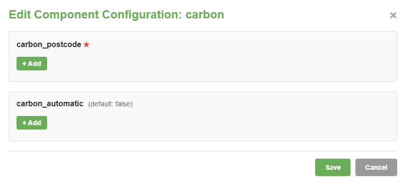

# Predbat Components Documentation

This document provides a comprehensive overview of all Predbat components, their purposes, and configuration options.

## Table of Contents

- [Overview](#overview)
- [Component List](#component-list)
    - [Database Manager (db)](#database-manager-db)
    - [Home Assistant Interface (ha)](#home-assistant-interface-ha)
    - [Home Assistant History (ha_history)](#home-assistant-history-ha_history)
    - [Web Interface (web)](#web-interface-web)
    - [MCP Server (mcp)](#mcp-server-mcp)
    - [GivEnergy Cloud Direct (gecloud)](#givenergy-cloud-direct-gecloud)
    - [GivEnergy Cloud Data (gecloud_data)](#givenergy-cloud-data-gecloud_data)
    - [Octopus Energy Direct (octopus)](#octopus-energy-direct-octopus)
    - [Axle Energy VPP (axle)](#axle-energy-vpp-axle)
    - [Ohme Charger (ohme)](#ohme-charger-ohme)
    - [Fox ESS API (fox)](#fox-ess-api-fox)
    - [Solax Cloud API (Solax)](#solax-cloud-api-solax)
    - [Solis Cloud API (Solis)](#solis-cloud-api-solis)
    - [Alert Feed (alert_feed)](#alert-feed-alert_feed)
    - [Carbon Intensity API (carbon)](#carbon-intensity-api-carbon)
- [Managing Components](#managing-components)
    - [Checking Component Status](#checking-component-status)
    - [Restarting Components](#restarting-components)
    - [Editing Component Configuration](#editing-component-configuration)
    - [Component Health](#component-health)

## Overview

Predbat uses a modular component architecture where each component provides specific functionality such as database management, cloud API integration, web interfaces, and energy provider integrations.
Each component can be enabled or disabled independently through your `apps.yaml` configuration file.

## Component List

### Database Manager (db)

**Can be restarted:** No

#### What it does (db)

Stores and manages all historical data for Predbat, including energy usage, sensor values, and system states. This allows Predbat to keep its own database of historical information independent of Home Assistant.

#### When to enable (db)

- You want to retain data longer than Home Assistant keeps or you want to run Predbat without Home Assistant

#### Configuration Options (db)

| Option | Type | Required | Default | Config Key | Description |
| ------ | ---- | -------- | ------- | ---------- | ----------- |
| `db_enable` | Boolean | Yes | - | `db_enable` | Set to `true` to enable the database, `false` to disable |
| `db_days` | Integer | No | 30 | `db_days` | Number of days of historical data to keep in the database |

---

### Home Assistant Interface (ha)

**Can be restarted:** No

#### What it does (ha)

Provides the connection between Predbat and Home Assistant. This is the core communication channel that allows Predbat to read sensor data, control devices, and update its status in Home Assistant.

If you are using Predbat without Home Assistant then this interface layer just talks directly to the Database Manager.

#### When to enable (ha)

This component is always enabled and required for Predbat to function.

#### Configuration Options (ha)

| Option | Type | Required | Default | Config Key | Description |
| ------ | ---- | -------- | ------- | ---------- | ----------- |
| `ha_url` | String | No | `http://supervisor/core` | `ha_url` | Home Assistant API URL (the default is for when using an HA add-on) |
| `ha_key` | String | No | Auto-detected | `ha_key` | Home Assistant access token (auto-detected when running as add-on) |
| `db_enable` | Boolean | No | False | `db_enable` | Enable database integration |
| `db_mirror_ha` | Boolean | No | False | `db_mirror_ha` | Copy Home Assistant data into Predbat's database |
| `db_primary` | Boolean | No | False | `db_primary` | Use Predbat's database instead of Home Assistant for the primary data source |

---

### Home Assistant History (ha_history)

**Can be restarted:** No

#### What it does (ha_history)

Retrieves and processes historical sensor data from Home Assistant's database (or from the Predbat database).
This component handles all lookups of past energy usage, battery levels, and other historical information.

#### When to enable (ha_history)

This component is always enabled.

#### Configuration Options (ha_history)

No configuration required. This component automatically uses your Home Assistant connection.

---

### Web Interface (web)

**Can be restarted:** Yes

#### What it does (web)

Provides a built-in web server that lets you view and manage Predbat through your web browser. Access dashboards, view battery plans, check logs, and edit configuration all from an easy-to-use web interface.

#### Configuration Options (web)

| Option | Type | Required | Default | Config Key | Description |
| ------ | ---- | -------- | ------- | ---------- | ----------- |
| `port` | Integer | No | 5052 | `web_port` | Port number for the web server |

#### How to access (web)

If you use Predbat as a Home Assistant add on then click 'Open Web UI' from the add-on or add Predbat Web UI to your side bar.
If you run Predbat outside then you can access it from the port as configured:  `http://homename:5052`

---

### MCP Server (mcp)

**Can be restarted:** Yes

#### What it does (mcp)

Provides a programmatic API that allows AI assistants (like ChatGPT, Claude, or other MCP-compatible tools) to read and control Predbat. This enables you to use natural language commands to check status, adjust settings, or override plans.

#### When to enable (mcp)

- You want to control Predbat through AI assistants
- You're building custom integrations or tools
- You want programmatic access to Predbat data

#### Security note (mcp)

The MCP server requires a secret key for authentication. Keep this secret secure and don't share it publicly.

***CAUTION*** Predbat WebUI does not support https currently, so exposing this MCP port externally to your home network would be unwise.

#### Configuration Options (mcp)

| Option | Type | Required | Default | Config Key | Description |
| ------ | ---- | -------- | ------- | ---------- | ----------- |
| `mcp_enable` | Boolean | Yes | False | `mcp_enable` | Set to `true` to enable the MCP server |
| `mcp_secret` | String | No | `predbat_mcp_secret` | `mcp_secret` | Secret key for authentication - change this! |
| `mcp_port` | Integer | No | 8199 | `mcp_port` | Port number for the MCP server |

#### How to configure your MCP client (mcp)

Below is an example MCP configuration inside VSCode, but it will be similar in Cline/Claude/Cursor etc.

```json
Example usage in VSCode
{
 "servers": {
  "predbat-mcp": {
   "url": "http://homeassistant.local:8199/mcp",
   "type": "http",
   "description": "Predbat Model Context Protocol Server",
   "headers": {
    "Authorization" : "Bearer predbat_mcp_secret",
   },
  }
 },
 "inputs": []
}
```

#### Available commands (mcp)

- Get current system status
- View and update configuration settings
- Browse all entities
- Retrieve battery plan data
- Override plan for specific time periods
- Access apps.yaml configuration

---

### GivEnergy Cloud Direct (gecloud)

**Can be restarted:** Yes

#### What it does (gecloud)

Connects directly to the GivEnergy Cloud to control your GivEnergy inverter and battery. This allows Predbat to automatically set charge/discharge times, power limits, and read real-time data from your inverter without relying on Home Assistant integrations.

#### When to enable (gecloud)

- You have a GivEnergy inverter
- You want direct cloud-based control (more reliable than local control)
- You have your GivEnergy Cloud API key
- You want automatic control of your battery

#### Important notes (gecloud)

- Requires a GivEnergy Cloud account and API key
- Can also control GivEnergy EV chargers and smart devices

#### Configuration Options (gecloud)

| Option | Type | Required | Default | Config Key | Description |
| ------ | ---- | -------- | ------- | ---------- | ----------- |
| `ge_cloud_direct` | Boolean | Yes | - | `ge_cloud_direct` | Set to `true` to enable GivEnergy Cloud control |
| `api_key` | String | Yes | - | `ge_cloud_key` | Your GivEnergy Cloud API key |
| `automatic` | Boolean | No | False | `ge_cloud_automatic` | Set to `true` to automatically configured Predbat to use GivEnergy Cloud direct (no additional apps.yaml changes required) |

#### How to get your API key (gecloud)

1. Log in to your GivEnergy account at <https://www.givenergy.cloud>
2. Go to Settings → API Keys
3. Generate a new API key
4. Copy the key into your `apps.yaml` configuration

---

### GivEnergy Cloud Data (gecloud_data)

**Can be restarted:** Yes

#### What it does (gecloud_data)

Downloads historical energy data from GivEnergy Cloud including consumption, generation, battery usage, and grid import/export. This provides accurate historical data for Predbat's calculations and predictions.

#### When to enable (gecloud_data)

- You have a GivEnergy system
- You want Predbat to use historical data from GivEnergy Cloud instead of from Home Assistant.

#### Configuration Options (gecloud_data)

| Option | Type | Required | Default | Config Key | Description |
| ------ | ---- | -------- | ------- | ---------- | ----------- |
| `ge_cloud_data` | Boolean | Yes | - | `ge_cloud_data` | Set to `true` to enable historical data download |
| `ge_cloud_key` | String | Yes | - | `ge_cloud_key` | Your GivEnergy Cloud API key (same as Cloud Direct) |
| `ge_cloud_serial` | String | No | Auto-detected | `ge_cloud_serial` | Your inverter serial number (usually auto-detected) |
| `days_previous` | List | No | [7] | `days_previous` | List of days to download data for, e.g., `[7]` for last week |

---

### Octopus Energy Direct (octopus)

**Can be restarted:** Yes

#### What it does (octopus)

Connects to your Octopus Energy account to automatically download your tariff rates, including support for dynamic tariffs like Agile and Intelligent Octopus. This ensures Predbat always has the most accurate and up-to-date energy pricing.

#### When to enable (octopus)

- You're an Octopus Energy customer
- You want automatic tariff updates
- You're on a variable tariff (Agile, Intelligent Octopus, etc.)
- You want to see your actual consumption data

#### Important notes (octopus)

- Works with all Octopus tariffs including Agile and Intelligent Octopus
- Automatically manages Intelligent Octopus smart charging slots
- Updates rates automatically, no manual intervention needed

#### Configuration Options (octopus)

| Option | Type | Required | Default | Config Key | Description |
| ------ | ---- | -------- | ------- | ---------- | ----------- |
| `key` | String | Yes | - | `octopus_api_key` | Your Octopus Energy API key |
| `account_id` | String | Yes | - | `octopus_api_account` | Your Octopus Energy account number (starts with A-) |
| `automatic` | Boolean | No | True | `octopus_automatic` | Set to `true` to automatically configure Predbat to use this Component (no need to update apps.yaml) |

#### How to get your API credentials (octopus)

1. Log in to your Octopus Energy account at <https://octopus.energy>
2. Go to your account dashboard
3. Find your API key (usually in Developer settings)
4. Your account number is shown on your dashboard (format: A-XXXXXXXX)

---

### Axle Energy VPP (axle)

**Can be restarted:** Yes

#### What it does (axle)

Connects to Axle Energy's Virtual Power Plant (VPP) [UK] service to receive and track demand response events.
When Axle schedules export events, this component will track them and store the history for up to 7 days.
The component publishes a binary sensor that turns on when an event is currently active.

If configured in Predbat's `apps.yaml` Predbat will control your inverter to export in response to the Axle event and adjusts the export energy rate to account for the extra payment from Axle.

Sign up with my referral code here: <https://vpp.axle.energy/landing/grid?ref=R-VWIICRSA>

*Please note you are not allowed to be on Octoplus at the same time, so contact Octopus if you need to be removed from this scheme.*

Select control my battery for 'Events Only'.

#### When to enable (axle)

- You're enrolled in Axle Energy's VPP program and want Predbat to be aware of the scheduled events and plan for them.

#### Important notes (axle)

- Polls the Axle API every 10 minutes for updates
- Stores event history for up to 7 days
- Events are added to history as soon as they start (become active)
- Binary sensor (default name `binary_sensor.predbat_axle_event`) is `on` when an event is currently active, `off` otherwise
- Event details and history are available as sensor attributes ('event_current' and 'event_history')
- When **axle_control** is enabled (set to True in `apps.yaml`), Predbat will enter read-only mode during active VPP events (default is False)
    - Read-only mode prevents Predbat from controlling the inverter while VPP events are running
    - Status will show as "Read-Only (Axle)" when this feature is active

#### Configuration Options (axle)

| Option | Type | Required | Default | Config Key | Description |
| ------ | ---- | -------- | ------- | ---------- | ----------- |
| `api_key` | String | Yes | - | `axle_api_key` | Your Axle Energy API key from the VPP portal |
| `pence_per_kwh` | Integer | No | 100 | `axle_pence_per_kwh` | Payment rate in pence per kWh for VPP events |
| `automatic` | Bool | No | True | `axle_automatic` | When enabled use the default Axle event entity name (**binary_sensor.predbat_axle_event**) |
| `control` | Bool | No | False | `axle_control` | When enabled puts Predbat into Read-Only mode during Axle events |

#### How to get your API credentials (axle)

1. Log in to your Axle Energy VPP portal at <https://vpp.axle.energy>
2. Navigate to the Home Assistant integration section
3. Copy your API key
4. Paste it into `axle_api_key` in apps.yaml

#### Sensor Attributes (axle)

The binary sensor `binary_sensor.predbat_axle_event` provides the following attributes:

- `event_current`: List containing the current event (if any), with fields:
    - `start_time`: Event start time (timezone-aware datetime)
    - `end_time`: Event end time (timezone-aware datetime)
    - `import_export`: Event type ("import" or "export")
    - `updated_at`: Last update timestamp
    - `pence_per_kwh`: Payment rate for this event
- `event_history`: List of past events (up to 7 days) with the same fields as above

---

### SolaX Cloud API (solax)

**Can be restarted:** Yes

#### What it does (solax)

Connects directly to the SolaX Cloud API to control SolaX inverters and batteries.
This allows Predbat to automatically set charge/discharge schedules, power limits, target SOC, and read real-time data from your inverter without requiring local Home Assistant integrations.

The component polls your SolaX Cloud account every minute for real-time data and every 30 minutes for device and plant information.
It publishes comprehensive sensors for battery status, energy totals, and provides full control over charging and discharging schedules.

#### When to enable (solax)

- You have a SolaX inverter (X1, X3, X3-Hybrid, or other cloud-connected models)
- You want cloud-based control without local integrations
- You have SolaX Cloud API credentials (client ID and secret)
- You want automatic battery charge/discharge optimization
- You want Predbat to read historical energy data directly from SolaX Cloud

#### Important notes (solax)

- Requires valid SolaX Cloud API credentials (client ID and client secret)
- Supports multiple plants/inverters with automatic discovery when `solax_automatic: true`
- Region-specific API endpoints: EU, US, or CN
- Authentication tokens are automatically managed (30-day expiry with auto-refresh)
- Supports both residential and commercial installations
- Control commands use time-window based scheduling (similar to GivEnergy)
- Read-only mode available with `solax_enable_controls: false`
- Compatible with Predbat's standard optimization algorithms

#### Configuration Options (solax)

| Option | Type | Required | Default | Config Key | Description |
| ------ | ---- | -------- | ------- | ---------- | ----------- |
| `client_id` | String | Yes | - | `solax_client_id` | Your SolaX Cloud API client ID |
| `client_secret` | String | Yes | - | `solax_client_secret` | Your SolaX Cloud API client secret |
| `region` | String | No | 'eu' | `solax_region` | API region: 'eu', 'us', or 'cn' |
| `plant_id` | String | No | None | `solax_plant_id` | Optional: Filter to specific plant ID |
| `automatic` | Boolean | No | False | `solax_automatic` | Auto-configure all entities and inverters |
| `enable_controls` | Boolean | No | True | `solax_enable_controls` | Enable inverter control (false for read-only) |

**Security Note:** Store `solax_client_id` and especially `solax_client_secret` in `secrets.yaml`:

```yaml
solax_client_id: !secret solax_client_id
solax_client_secret: !secret solax_client_secret
```

#### How to get your API credentials (solax)

1. Log in to your SolaX Cloud account:
   - EU: <https://www.solaxcloud.com>
   - US: <https://www.solaxcloud.us>
   - CN: <https://www.solaxcloud.com.cn>
2. Navigate to Settings → API Management (or Developer Settings)
3. Create a new API application or view existing credentials
4. Copy your **Client ID** and **Client Secret**
5. Add to your `secrets.yaml` file
6. Reference in `apps.yaml` using `!secret` notation

#### Published Entities (solax)

For each plant (replace `{plant_id}` with your actual plant ID), the component creates:

**Battery Sensors:**

- Battery SOC (kWh)
- Battery capacity (kWh)
- Battery temperature (°C)
- Battery max power (W)

**System Sensors:**

- Inverter max power (W)
- PV capacity (kWp)
- Total PV yield (kWh)
- Total battery charged (kWh)
- Total battery discharged (kWh)
- Total grid imported (kWh)
- Total grid exported (kWh)
- Total load (kWh, calculated)
- Total earnings (currency)

**Power Sensors (per inverter):**

- Charge/discharge power (W)
- Grid power (W)
- PV power (W)
- AC load power (W)

**Control Entities:**

- Battery reserve SOC (number, %)
- Charge start/end times (select, HH:MM:SS format)
- Charge target SOC (number, %)
- Charge rate (number, W)
- Charge enable (switch)
- Export start/end times (select, HH:MM:SS format)
- Export target SOC (number, %)
- Export rate (number, W)
- Export enable (switch)

#### Testing your configuration (solax)

You can test your SolaX Cloud API connection independently:

```bash
cd /config/appdaemon/apps/predbat
python3 solax.py --client-id YOUR_CLIENT_ID --client-secret YOUR_CLIENT_SECRET --region eu
```

This will authenticate, fetch all plants, devices, and real-time data, helping diagnose any connection or configuration issues.

---

### Ohme Charger (ohme)

**Can be restarted:** Yes

#### What it does (ohme)

Integrates with Ohme EV chargers to monitor charging sessions and coordinate charging with your energy tariff. Works particularly well with Intelligent Octopus to optimize charging times and costs.

#### When to enable (ohme)

- You have an Ohme EV charger
- You want Predbat to factor in the charging plan within Ohme, this is mostly used with Octopus Intelligent GO.

#### Important notes (ohme)

- Requires your Ohme account credentials
- Can automatically manage Intelligent Octopus charging slots
- Monitors real-time charging status and energy consumption

#### Configuration Options (ohme)

| Option | Type | Required | Default | Config Key | Description |
| ------ | ---- | -------- | ------- | ---------- | ----------- |
| `email` | String | Yes | - | `ohme_login` | Your Ohme account email address |
| `password` | String | Yes | - | `ohme_password` | Your Ohme account password |
| `ohme_automatic_octopus_intelligent` | Boolean | No | - | `ohme_automatic_octopus_intelligent` | Set to `true` to automatically sync with Intelligent Octopus |

---

### Fox ESS API (fox)

**Can be restarted:** Yes

#### What it does (fox)

Integrates with Fox ESS inverters for monitoring and controlling Fox ESS battery systems. Similar to GivEnergy Cloud Direct, but for Fox ESS equipment.

#### When to enable (fox)

- You have a Fox ESS inverter
- You want direct API control of your Fox system
- You have your Fox ESS API key

#### Important notes (fox)

- Requires Fox ESS Cloud account and API key

#### Configuration Options (fox)

| Option | Type | Required | Default | Config Key | Description |
| ------ | ---- | -------- | ------- | ---------- | ----------- |
| `key` | String | Yes | - | `fox_key` | Your Fox ESS API key |
| `automatic` | Boolean | No | False | `fox_automatic` | Set to `true` to automatically configured Predbat to use the Fox inverter (no manual apps.yaml updates required) |

---

### Solis Cloud API (solis)

**Can be restarted:** Yes

#### What it does (solis)

Integrates with Solis inverters for monitoring and controlling Solis battery systems via the Solis Cloud API. Provides direct control of charge/discharge schedules, storage modes, and battery parameters.

#### When to enable (solis)

- You have a Solis hybrid inverter with battery storage
- You want direct API control of your Solis system
- You have your Solis Cloud API credentials

#### Important notes (solis)

- **EXPERIMENTAL**: This is a new integration and may have issues
- Requires Solis Cloud account with API access
- **IMPORTANT**: Currently the Solis Cloud integration cannot determine your battery size. You **must** set `soc_max` in `apps.yaml` manually with your battery capacity in kWh
- Supports both V1 (older firmware) and V2 (newer firmware) time window formats
- Automatic configuration available - sets up all required Predbat sensors automatically

#### Configuration Options (solis)

| Option | Type | Required | Default | Config Key | Description |
| ------ | ---- | -------- | ------- | ---------- | ----------- |
| `api_key` | String | Yes | - | `solis_api_key` | Your Solis Cloud API Key (KeyId) |
| `api_secret` | String | Yes | - | `solis_api_secret` | Your Solis Cloud API Secret (KeySecret) |
| `inverter_sn` | String/List | No | - | `solis_inverter_sn` | Inverter serial number(s) - Leave unset to see all. Single string or list of strings for multiple inverters |
| `automatic` | Boolean | No | False | `solis_automatic` | Set to `true` to automatically configure Predbat to use the Solis inverter (no manual apps.yaml sensor updates required) |
| `base_url` | String | No | Auto-detected | `solis_base_url` | Solis Cloud API base URL (automatically selects correct region) |
| `control_enable` | Boolean | No | True | `solis_control_enable` | Enable/disable control commands (set to false for monitoring only) |

---

### Alert Feed (alert_feed)

**Can be restarted:** Yes

#### What it does (alert_feed)

Monitors weather alert feeds (MeteoAlarm) for severe weather warnings that might impact your energy usage or solar generation. Predbat can use this information to adjust its planning accordingly.

#### When to enable (alert_feed)

- You want Predbat to be aware of weather alerts
- You want to adjust battery strategy based on weather warnings
- You're in an area with frequent severe weather

#### How it works (alert_feed)

- Checks for alerts every 30 minutes
- Processes weather warnings for your area
- Can be configured with custom alert URLs and filters

#### Configuration Options (alert_feed)

| Option | Type | Required | Default | Config Key | Description |
| ------ | ---- | -------- | ------- | ---------- | ----------- |
| `alert_config` | Dictionary | Yes | {} | `alerts` | Alert configuration including URL and filters |

#### Configuration example

See the main configuration documentation for more details

---

### Carbon Intensity API (carbon)

**Can be restarted:** Yes

#### What it does (carbon)

Retrieves current and forecast carbon intensity data for the UK electricity grid. This allows Predbat to make environmentally-conscious decisions, charging your battery when grid electricity is greener and discharging when it's more carbon-intensive.

#### When to enable (carbon)

- You want to minimize your carbon footprint
- You're interested in carbon-aware energy management
- You're in the UK (uses UK National Grid data)
- You want to see carbon intensity alongside cost optimization

#### How it works (carbon)

- Uses your postcode to get regional carbon intensity data
- Provides both current intensity and forecasts
- Updates automatically throughout the day

Note: To use the carbon data in Predbat you also have to turn on **switch.predbat_carbon_enable**. If you want to optimise your plan for carbon then you also need to adjust the carbon weighting.

#### Configuration Options (carbon)

| Option | Type | Required | Default | Config Key | Description |
| ------ | ---- | -------- | ------- | ---------- | ----------- |
| `postcode` | String | Yes | - | `carbon_postcode` | Your UK postcode for regional carbon intensity data |
| `automatic` | Boolean | No | False | `carbon_automatic` | Set to `true` to automatically point Predbat to the carbon data |

---

## Managing Components

### Checking Component Status

You can check the status of all components through the web interface:

1. Open the web interface (default: `http://your-ha-ip:5052`)
2. Navigate to the **Components** page (`/components`)
3. View the status of each component:
   - **Enabled/Disabled** - Whether the component is configured
   - **Running/Stopped** - Current operational status
   - **Healthy/Unhealthy** - Whether the component is working correctly
   - **Last Updated** - When the component last successfully updated

### Restarting Components

Most components can be restarted if they encounter problems:

- Use the 'Restart' button on the Components page in the web interface
- Or restart Predbat entirely to restart all components

**Note:** Core components (Database Manager, Home Assistant Interface, and Home Assistant History) cannot be restarted individually and require a full Predbat restart.

### Editing Component Configuration

Click the Pencil icon next to a component to change the component configuration, e.g.:



Once you save the component configuration the changes will be written to `apps.yaml` and Predbat and all components will be restarted.

### Component Health

A component is considered healthy when:

- Its task is running
- It has updated within the last 60 minutes
- It reports no errors

If a component becomes unhealthy:

1. Check your configuration in `apps.yaml`
2. Verify API keys and credentials are correct
3. Check network connectivity
4. Review Predbat logs for error messages
5. Try restarting the component

---
