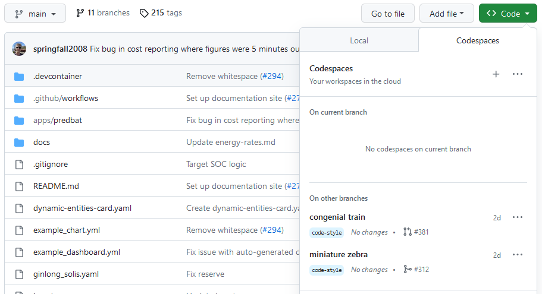

# Developing on Predbat

## Creating a fork

Using GitHub, take a fork of Predbat - effectively, this creates
a copy of the main repository, but in your personal space.
There, you can create branches to develop on.

## Pull requests

Once you've completed your work on your branch, you can create a
pull request (PR) to merge your work back into the `main` branch
of Predbat.

This PR should describe the work you've done in a way that
makes it easy for someone to review your work, and either
add comments or approve it.

## Unit level testing

Note you will need to install python_matplotlib (e.g. brew install python_matplotlib or pip install matplotlib)

Predbat now has some unit-level tests, to run them on your local machine:

1. Create a test directory somewhere
2. Copy `apps.yaml` to your test area
3. Copy the files from github <https://github.com/springfall2008/batpred/tree/main/coverage> to this area
4. Extract cases.tgz
5. Have /Volumes/add_configs/6adb4f0d_predbat point to your Predbat add-on directory or edit run_all to change the path
6. Run run_all

If the tests fail then debug them.

For coverage analysis installed the 'coverage' library with Python

1. run run_cov
2. Open `htmlcov/index.html` in your web browser

## Editing the code

There are at least a couple of ways of working on the code, outlined here.

### Using GitHub Codespaces

#### What is GitHub Codespaces?

Especially if you don't need to have a running Home Assistant system
to make the changes you're interested in (e.g. for documentation,
quick fixes etc.) a really easy way to work on the code is by using
GitHub Codespaces.

GitHub Codespaces gives you a full-featured development environment.
This includes:

- A full IDE (a code editor), Visual Studio Code, which can be:
    - Run in the browser, requiring no additional software to
    be installed
    - Run in a virtual machine (VM) running in the cloud which
    can connect to a copy of VS Code installed on your own
    machine
- A terminal where you can run commands against your codebase
e.g. running `pre-commit` to run the automatic code quality checks, linting files, etc.
- Software like `mkdocs` to re-generate the documentation files (and other software we may include)
pre-installed in it

The Codespaces environment is entirely separate from your HA
installation, so does not require any modification to your HA
setup to work with it.

However, you are modifying code in an environment where you
can't see HA running, so it's great for things like
updating documentation, or writing automated tests, but not
if you need to see your changes live within HA.

#### Running GitHub Codespaces

You may wish to first install [VS Code](https://code.visualstudio.com/download)
on your machine, which does offer some benefits compared to running
Codespaces in the cloud, but this is certainly not essential, and
you'll see the same code editor and terminal, and you'll have the
same commands and Python packages available in the terminal.
The local installation is better in a small number of
scenarios e.g. if you need to connect from your browser to a specific port
on the VM, such as if you're working on the documentation.

Importantly, even if you do a local install of VS Code and use that
to edit your code within GitHub, the terminal, the code you're editing
any commands that you run, and any processes like `mkdocs` that you
may browse to are all running in the Codespaces VM. Your local
VS Code is connected to the VM through SSH. It will appear as if
the code, the terminal etc. are local, but they are not. Running
a local VS Code install connected to Codespaces will not install
Python, Python packages or anything else on your local machine.

Now, from your fork or branch, click on the Code button, and select the Codespaces tab.
You can create multiple environments, or use a single environment and swap
between branches in it.

Once you start your Codespaces environment, it will take a minute to
create a VM for you, and to install the software we've asked it to
install in there. It will also clone your repository and branch into
it for you, and the VM will be authenticated with GitHub
so you can commit and push straight back to your fork of Predbat on GitHub.

You can choose between running the IDE in the browser or having
your local installation of VS Code connects to the environment that GitHub
Codespaces has created for you.

The Codespaces will be already set up with Python, along with various
Python packages (as defined in `requirements.txt`). The environment
is configured through the config in `.devcontainer/devcontainer.json`.

### Developing locally within Home Assistant

To be documented later.

## Working on the documentation

### Overview of the Predbat documentation

The documentation site at [https://springfall2008.github.io/batpred/](https://springfall2008.github.io/batpred/)
is built from Markdown files in this repo.

The Markdown files used to build the documentation are in the `docs/` folder,
with additional config for building the documentation site in `mkdocs.yml`.

If you're making minor changes to the documentation e.g. fixing a spelling,
you can just edit the Markdown files directly, and it will be pushed to the
main documentation site as outlined in [the documentation build process](#the-documentation-build-process)
section below, once your changes are merged into `main` and released.

However, if you're doing more than that, e.g. adding new sections, working
with lists etc. we recommend you follow the instructions in
[working locally on the documentation](#working-locally-on-the-documentation)
below, as this will give you a live preview of what the documentation
will look like once it's built and published. This will avoid any
unexpected results appearing in the main documentation site.

If you are adding a new file, please ensure you add that file to
`mkdocs.yml`, so it will be linked from the menu in the sidebar.

### The documentation build process

The documentation for the site is built using `mkdocs`, which will
already be installed if you're using a GitHub Codespaces environment.

For a detailed explanation of `mkdocs` features, please read the
`mkdocs` [documentation](https://www.mkdocs.org/user-guide/).

As briefly covered above, `mkdocs.yml` contains the config for defining the documentation site,
and the documentation is built by `mkdocs` reading the Markdown files in the `docs/` folder,
and creating HTML files from those files. `mkdocs` can be used locally for previewing,
but is also used as part of the documentation build process that publishes
the official documentation site.

The publishing of the documentation is triggered by a GitHub action,
as defined in `.github/workflows/main.yml`.

In short, after configuring the build environment, `mkdocs` builds the
site then pushes the HTML produced to the `gh-pages` branch,
overwriting whatever was there previously.

GitHub will then detect a new commit on the `gh-pages` branch,
and that will trigger another action to run (as defined by GitHub).
This action will take the HTML files on the `gh-pages` branch
and will make them available at [https://springfall2008.github.io/batpred/](https://springfall2008.github.io/batpred/).

The documentation will be published as it is, with no further
review process, so please ensure you check the documentation
that will be built before merging it in.

### Working locally on the documentation

If you are making changes to the documentation, you can see
a live preview version of the documentation as it will be
built and deployed.

This preview version is local to your environment, is
temporary, and does not impact the published version in any way.

It's recommended for anything other than simple changes
like fixing spelling, or adding a sentence or two. Things like
new sections, lists, new pages etc. are best previewed
due to the complications of various Markdown standards,
as what works on GitHub READMEs, for example, does not
necessarily work with the published documentation site
(which follows a more strict Markdown standard).

There are a number of terminal commands that you can use in the Codespaces environment. Open a terminal window in Codespaces by choosing Menu> Terminal > New Terminal.

To run the live preview, enter `mkdocs serve` in the terminal window - this will cause `mkdocs` to build a
local temporary version of the documentation site,
and to temporarily publish it on port 8000 - it will
show the link where you can access the documentation.

Also, it will watch the `docs/` folder, and any time you change the
files, it will rebuild the site, allowing you to see changes to
the Markdown files in your browser within a few seconds.

The site will continue being served until you press `CTRL-C` to
end the `mkdocs serve` command.

*Note, accessing the site published by `mkdocs serve` is not
possible if you are using Codespaces to run VS Code in the browser,
but it is possible if you're using it via VS Code running locally,
due to how ports on your environment are shared.*

## Coding standards

### Expected standards

This section will be enhanced following discussions as we go.

However, here's a starting point:

- Variable names should be `lower_case_with_underscores` - this fits
with most existing variables, is a common standard for Python code,
and also allows the spell checking to check individual words within
the variable name.

### Enforced standards

Certain coding standards are enforced within the repository.
Some of them can be auto-fixed if you do a commit that
fails one of those standards; other issues will need fixing
first, as your pull request won't merge in GitHub until it passes.

These standards are enforced by [pre-commit](https://pre-commit.com),
a tool which can run other tools to check, and potentially fix
(for certain types of issues) any mistakes you've made.

The `.pre-commit-config.yaml` file lists all checks that are
currently carried out within the repository. Bear in mind that
these checks are done according to the config within that file
in the branch that you are working in,
so if someone adds a new check, or changes some of the related settings,
it won't apply on your branch until you've merged in their changes.

Some of the tools have their own related config files:

- CSpell - `.cspell.json` and `.cspell/custom-dictionary-workspace.txt`
- Black - `pyproject.toml`
- Markdown Lint - `.markdownlint.jsonc`

Additional notes on some of the standards:

- CSpell - if you have the spelling check failing due to a valid word
which is not in the in-built dictionary, please add that word to the end
of `.cspell/custom-dictionary-workspace.txt` and stage those changes.
The spell-check should then pass. Note, that the dictionary file will get
re-sorted alphabetically when you run `pre-commit`, so you'll need to
re-stage the file after it's been sorted.

#### Running the checks locally

If you are using a Codespaces environment, you'll already have `pre-commit`
installed automatically. You can run it manually, or automatically.

Running `pre-commit` manually:

- In a terminal window, running `pre-commit` will run all the checks against any files that you
have modified and staged.

- Alternatively, running `pre-commit run --all-files` will run all the checks
against all files within the repository.

- Note that if `pre-commit` makes any changes to any files when it runs,
those changes will not be staged. You will need to stage those changes too
before committing.

- You may notice `pre-commit` mentioning about stashing changes - this is
because when it runs, any changes that aren't staged are stashed (saved
away temporarily) so it runs against only the staged changes;
after it has run, it pulls back those stashed changes, so they appear
again (still unstaged).

Running `pre-commit` automatically:

- If you run `pre-commit install` in a terminal window it will install a pre-commit hook -
this is a file which tells `git` to run some code for each type you do a
particular action (a pre-commit hook runs at the start of processing
a commit, but there are other hooks e.g. pre-push).

- Now, any time you perform a commit, `pre-commit` will run
automatically on the staged files - this is a handy way of making sure
that you don't accidentally commit code which will fail checks later.

- You can still run it manually as outlined above, in addition to the
automated checks that it will do on commits.

#### Running the checks from within GitHub

When commits are done on pull requests, and in any other scenarios
added to the `on` section of`.github/workflows/linting.yml`,
the GitHub Actions in that file will run.

In particular, the [pre-commit.ci lite](https://pre-commit.ci/lite.html)
action will run. This uses the code [here](https://github.com/pre-commit-ci/lite-action)
to run the same checks that get run locally
(as described in the `.pre-commit-config.yaml` file).

This will cause your commit, branch or pull request to get either a green tick
or a red cross against it, to show whether the code passed the checks or not.
This will happen automatically when you push code on a branch that has a
pull request.

In addition, if `pre-commit` finds any errors it can fix
(e.g. a missing blank line at the end of a file, or trailing whitespace),
it will make a commit of its own to fix those problems and will push that
commit back to your branch on GitHub. This will then trigger another run,
which should now pass.

**Note**: This means that `pre-commit` will be adding commits to
your branch - this will need you to be pulling changes from GitHub
so you pick up the changes that have been added by `pre-commit`
otherwise, you will hit a problem when you next try to push a commit
on your branch. You can pull in those changes by running `git pull`
, which is the equivalent of running `git fetch` and then `git merge`.
This is no different to working on the same branch with another developer,
but it will be different to the workflow most of us have when working
on Predbat.
