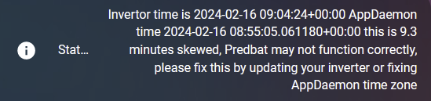

# FAQ

## I've installed Predbat but I don't see the correct entities

- First look at predbat.status in Home Assistant and the AppDaemon.log (which can be found in the list of log files in the System/Log area of the GUI).
See if any errors are warnings are found. If you see an error it's likely something is configured wrongly,
check your entity settings are correct.
- Make sure Solcast is installed and it's auto-updated at least a couple of times a day (see the [Solcast instructions](install.md#solcast-install)).
The default solcast sensor names maybe wrong, you might need to update the `apps.yaml` config to match your own names
(some people don't have the solcast_ bit in their names)
- Did you configure AppDaemon apps_dir correctly in `appdaemon.yaml`?

## Why is my predicted charge % higher or lower than I might expect?

- Predbat is based on costing, so it will try to save you money. If you have the PV 10% option enabled it will also
take into account the more worse case scenario and how often it might happen, so if the forecast is a bit unreliable
it's better to charge more and not risk getting stung importing.
- Have you checked your energy rates for import and export are correct, maybe check the rates graph and confirm.
If you do something like have export>import then Predbat will try to export as much as possible.
- Have you tuned Solcast to match your output accurately?
- Have you tuned **predbat_best_soc_keep settings**?
- Do you have predicted car charging during the time period?
- You can also tune **predbat_load_scaling** and **predbat_pv_scaling** to adjust predictions up and down a bit
- Maybe your historical data includes car charging, you might want to filter this out using car_charging_hold (see below)

## Why didn't the slot actually get configured?

- Are you in read-only mode?

## My plan doesn't include any charging?

- Do you have the predbat_mode set to Control charge (or Control charge & discharge)?

## The charge limit keeps increasing/decreasing in the charge window or is unstable

- Check you don't have any other automations running that adjust GivTCP settings during this time. Some people had
a script that changes the reserve %, this will cause problems - please disable other automations and retry.

## I changed a config item but it made no difference?

- You might have to wait a few minutes until the next update cycle. Depending on the speed of the computer that Predbat is running on, it can take 1-5 minutes for Predbat to run through.
You can see the date/time that Predbat last completed a run at the start of the [Predbat HTML plan](predbat-plan-card.md).

## It's all running but I'm not getting very good results

- You might want to tune **input_number.predbat_best_soc_keep** to set a minimum target battery level, e.g. I use 2.0 (for 2kWh, which is just over 20% on a 9.5kWh battery).
If you set **input_number.predbat_best_soc_keep** too high then predbat could need to charge the battery in unfavourable import rates, so try to set it to a fairly low value,
especially if you have a small battery. If you set it to zero then predbat may not charge at all, so use 0.1 as a minimum.
- Have a read of the [energy rates configuration guide](energy-rates.md) as depending on your tariff different settings maybe required
- Check your solar production is well calibrated (you can compare solcast vs actually in the Home Assistant energy tab or on the GivEnergy portal)
- Make sure your inverter max AC rate has been set correctly
- If you have an EV that you charge then you will want some sort of car charging sensor or use the basic car charging hold feature or your load predictions maybe unreliable - see
[Car charging planning](car-charge-planning.md)
- Do you have a solar diverter? If so maybe you want to try using the [iBoost model settings](customisation.md#iboost-model-solar-diverter-options).
- Perhaps set up the calibration chart and let it run for 24 hours to see how things line up
- If your export slots are too small compared to expected check your inverter_limit is set correctly (see below)

## When my battery is charging to 100% is fluctuates between 98% and 100%, and/or gives an error setting reserve

Some inverters e.g. GE AIO inverter won't allow the reserve to be set too 100, in which case set in apps.yaml

```yaml
inverter_reserve_max : 98
```

And this should prevent the issue

## The plan doesn't charge or discharge when I expect it to

Predbat can only work on the information its given, although it does run every 5 minutes when it re-evaluates the plan and adjusts if necessary.

The plan Predbat produces assumes that your average load and PV forecasts are accurate and Predbat will aim to give you the maximum return.

Make sure you have setup your [Solcast solar forecast correctly](install.md#solcast-install) with the number of panels, orientation, output, etc.

Projected daily load is determined from historical load information so make sure you have set [days_previous and days_previous_weight in apps.yaml](apps-yaml.md#basics)
to give appropriately representative load history to Predbat, and read the [longer explanation of how days_previous works](apps-yaml.md#understanding-how-days_previous-works).

You could adjust **input_number.predbat_load_scaling** to 1.2 so the plan will incorporate 20% more expected load if you want to be more pessimistic about historical load,
and **input_number.predbat_pv_scaling** to similarly adjust the PV forecast - these and other adjustment options are described in the [Scaling and Weight options](customisation.md#scaling-and-weight-options).

It is very important to correctly set Predbat's [Battery Loss Options](customisation.md#battery-loss-options)
and [Battery Margins](customisation.md#battery-margins-and-metrics-options) as these can have a huge and critical impact on the plan that Predbat generates.

Predbat's default configuration values are the recommended starting values for most users but there is no single right set of configuration values for every user of Predbat,
it depends on many factors and your personal preferences. Many users will need to customise and tweak their [Predbat configuration](customisation.md) to suit their needs.

The SoC level that Predbat aims to keep in the battery **input_number.predbat_best_soc_keep**
and the absolute minimum SoC level **input_number.predbat_best_soc_min** are the first thing to check.
If these are set too high then Predbat will charge at unfavourable rates to maintain the battery SoC.
Conversely if you find Predbat is letting the battery exhaust too early, set predbat_best_soc_keep to 1.0 so Predbat will aim to keep 1kWh available for unexpected load.

Predbat performs a lowest cost battery optimisation so a key part of deciding whether to charge, discharge or feed the house from the battery are the loss rates
**input_number.predbat_battery_loss**, **input_number.predbat_battery_loss_discharge** and **input_number.predbat_inverter_loss**.
Typical values could be 4, 4, 4 or 5, 5, 5.  It is tempting to set these inverter loss figures lower to encourage Predbat to use the battery more,
but this should be resisted as experience from the GivEnergy community forum suggests total energy conversion losses are in the range of 10-20%.

Putting these losses into context and assuming you have an AC-coupled battery and have set the losses to 4, 4 and 4;
then for every kWh charged from the grid you will only get 0.92kWh stored in the battery (4% charge + 4% inverter conversion loss)
and similarly when that 0.92kWh is discharged to the home you will only receive 0.85kWh (0.92 x 0.92).

These loss percentages also impact the Predbat plan. Consider an import rate of 20p/kWh; after conversion losses are considered,
each 1kWh of stored battery charge will in effect have cost 21.7p (20 / 0.92) to import.

Then for discharging, the same applies. Each kWh of stored battery charge (that cost 21.7p to charge) will in effect have cost 23.6p (21.7 / 0.92) to discharge.
Predbat makes cost optimisation decisions so unless the current import rate is more than 23.6p, it will be cheaper to let the home run off grid import rather than to discharge the battery.

If you turn [debug mode on for the Predbat plan](predbat-plan-card.md#debug-mode-for-predbat-plan) then you can see the
effective import and export rates after losses that Predbat calculates in the Predbat plan.

Predbat also uses **input_number.predbat_metric_battery_cycle** (_expert mode_ setting) to apply a 'virtual cost' in pence per kWh for charging and discharging the battery.
The default value is 1p but this this can be changed to a different value to recognise the 'cost of using the battery', or set to zero to disable this feature.

So if metric battery cycle is set to 1p, and continuing the example above, each kWh of battery charge will be costed at 22.7p (21.7p + 1p battery metric to charge),
and the battery will not be discharged to support the home unless the current import rate is more than 25.6p (23.6p + 1p cost of charging + 1p cost to discharge).

**input_number.predbat_metric_min_improvement** and **input_number.predbat_metric_min_improvement_discharge** (both _expert mode_ settings) also affect Predbat's cost optimisation decisions
as to [whether its cost beneficial to charge or discharge the battery](customisation.md#battery-margins-and-metrics-options)
so could be tweaked if you feel Predbat is charging or discharging with marginal benefits. The defaults (0p and 0.1p respectively) should however give good results for most users.

Finally, it could be worth considering adding [import or export rate increments](energy-rates.md#manually-over-riding-energy-rates) to `apps.yaml` if you want to direct Predbat
to avoid or encourage charging or discharging in certain time periods - e.g. avoiding exporting in the time period saving sessions normally fall in,
or to encourage discharging just before import rates fall overnight.

## Predbat is causing warning messages about 'exceeding maximum size' in the Home Assistant Core log

If you have a large **input_number.predbat_forecast_plan_hours** then you may see warning messages in the Home Assistant Core log about the size of the predbat.plan_html entity,
the message will be "State attributes for predbat.plan_html exceed maximum size of 16384 bytes".
This is just a warning, the Predbat html plan entity isn't stored in the database anyway, but you can suppress the warning by adding the following to your `configuration.yaml` file:

```yaml
# Filter out 'message too large' warnings from Predbat
logger:
  default: warning
  filters:
    homeassistant.components.recorder.db_schema:
      - "State attributes for predbat.plan_html exceed maximum size of 16384 bytes. This can cause database performance issues; Attributes will not be stored"
```

## Error - metric_octopus_import not set correctly or no energy rates can be read

If you get this error in the Predbat log file:

- Check that the Octopus integration is working and that **event.octopus_energy_electricity_<meter_number>_current_day_rates**
and **sensor.octopus_electricity_energy_<meter_number>_current_rate** are both populated by the integration.
- Ensure that you have followed the [Octopus Integration Installation instructions](install.md#octopus-energy), including enabling the Octopus Integration events.
- If you been using an older version of the Octopus integration and have upgraded to version 9 or above, then you may find that your energy sensors are named **sensor.electricity_<meter_number>_current_rate**
(i.e. no 'octopus_energy_' prefix) but the 'event' entities have the 'octopus_energy' prefix.<BR>
If the 'event' and 'sensor' entities are not consistently named then Predbat will not be able to find the event entities if the sensor names don't match what's expected.<BR>
To fix this, uninstall the Octopus integration, reboot Home Assistant,
delete all the old Octopus sensors, and [re-install the Octopus Integration](install.md#octopus-energy).

## WARN: No solar data has been configured

If you get this warning message in the Predbat log file or you see that the 'PV kWh' column in the [Predbat plan card](predbat-plan-card.md) is completely blank:

- Ensure that you have [installed and configured Solcast correctly](install.md#solcast-install)
- Check the Solcast integration in Home Assistant is configured and enabled (go to Settings / Integrations / Solcast )
- Check that there are no errors relating to Solcast in the Home Assistant log (go to Settings / System / Logs and view the 'Home Assistant Core' log)
- Verify the solar forecast has been populated in Home Assistant by going to Developer Tools / States, filtering on 'solcast',
and checking that you can see the half-hourly solar forecasts in the Solcast entities
- If you can see the solcast entities but there are no forecast PV figures, try running the 'Solcast update' automation you created, and check again the solcast entities
- If the solcast entities are still not populated, try reloading the Solcast integration (go to System / Devices & Services / Integrations tab, click on 'Solcast PV Forecast',
click the three vertical dots beside 'Configure' and choose 'Reload' from the dropdown menu)
- Check **sensor.solcast_pv_api_limit** (it's normally 10 for new Solcast accounts) meaning you can call the Solcast API 10 times a day
(but if you have two solar arrays, e.g. East/West) then retrieving the forecast will count as two API calls.<BR>
Compare this to **sensor.solcast_pv_api_used** to see how many Solcast API calls you have made today
(alternatively, you can confirm how many API calls you have made today by logging into your Solcast account).<BR>
If you've run out of API calls you will have to wait until midnight GMT for the API count to reset.
It's recommended that you don't include the Solcast forecast within your GivEnergy portal to avoid running out of API calls.
- Check the [Solcast server API status](https://status.solcast.com/) is OK

## Note: Can not find battery charge curve

If you get the message "Note: Can not find battery charge curve, one of the required settings for soc_kw, battery_power and charge_rate are missing from apps.yaml" in the logfile
then Predbat is trying to create a battery charge curve but does not have access to the required history information in Home Assistant.

[Creating the battery charge curve](apps-yaml.md#workarounds) is described in the apps.yaml document.
The most likely cause of the above message appearing in the logfile is that you are controlling the inverter in REST mode
but have not uncommented the following entities in apps.yaml that Predbat needs to obtain history from to create the battery charge curve:

```yaml
  charge_rate:
    - number.givtcp_{geserial}_battery_charge_rate
  discharge_rate:
    - number.givtcp_{geserial}_battery_discharge_rate
  battery_power:
    - sensor.givtcp_{geserial}_battery_power
  soc_kw:
    - sensor.givtcp_{geserial}_soc_kwh
```

## WARN: Inverter is in calibration mode

If you see the message "WARN: Inverter is in calibration mode, Predbat will not function correctly and will be disabled" in the logfile,
then Predbat has identified that your inverter is currently calibrating your battery. Predbat's status will also be set to 'Calibration'.

Predbat will set the inverter charge and discharge rates to maximum (if they are not already), SoC target to 100% and battery reserve to minimum (usually 4%),
and will not execute the plan nor enable battery charge or discharge.

Once the inverter finishes calibrating the battery, Predbat will resume normal operations.

## Inverter time is xxx AppDaemon time is xxx this is xxx minutes skewed, Predbat may not function correctly

If the **predbat.status** gives a warning error about the inverter time:



Then it indicates that there is a mis-match between the clock that Predbat AppDaemon is using and the inverter time clock, and clearly with a clock mis-match,
charging and discharging your battery at specific times may not work as expected.

There are several potential causes of this problem:

- Check that the inverter time is correctly set, especially that its set to GMT (even if its summer time).
In the GivEnergy portal, go to My Inverters / Remote Control (cog symbol) / click SEND next to 'Set Date and Time'
- Check that the [time_zone in appdaemon.yaml](install.md#appdaemon-install) is correctly set for your location (e.g. Europe/London)
- The time zone for [Predbat in apps.yaml](apps-yaml.md#basics) needs to be set to the same value
- Finally, check how often your inverter integration is polling your inverter for new data. For [GivTCP the Self Run Loop Timer](apps-yaml.md#rest-interface-inverter-control)
is recommended to be set to a value of between 20 and 60 seconds.

## I have another problem not listed above

If you are still having trouble feel free to raise a [Github ticket](https://github.com/springfall2008/batpred/issues) for support
