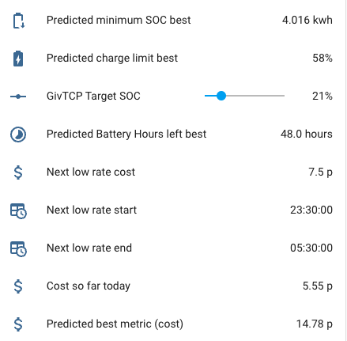

# Output data

## Displaying output data

Each Predbat config item has an input_number or switch associated with it, you can find an auto-generated dashboard for your
configuration in your AppDaemon configuration area under the filename **predbat_dashboard.yaml**.
You will need to open that file in a Home Assistant file editor and copy the contents into a new dashboard page.

You can also create a dashboard page using [dynamic-entities-card.yaml](https://raw.githubusercontent.com/springfall2008/batpred/main/templates/dynamic-entities-card.yaml) for a
dynamically created list of all Predbat entities which groups the entities by type and is collapsed by default to prevent screen clutter. Requires lovelace-collapsable-cards
([https://github.com/RossMcMillan92/lovelace-collapsable-cards](https://github.com/RossMcMillan92/lovelace-collapsable-cards))
and lovelace-auto-entities ([https://github.com/thomasloven/lovelace-auto-entities](https://github.com/thomasloven/lovelace-auto-entities))
to be installed via HACS as well as the stock vertical stack card. Credit @DJBenson for the code.

The Predbat Plan card is very useful for seeing the plan that Predbat has created - [Create the Predbat Plan card](predbat-plan-card.md).

A set of Apex Charts can also be created to see graphically what Predbat plans to do - [Creating the charts](creating-charts.md).

## Basic status

- **switch.predbat_active** - Automatically set by Predbat to On when Predbat is busy calculating or controlling your inverter,
or Off when Predbat is waiting for the next time it needs to perform a plan calculation update.
If you toggle this switch in Home Assistant it will force Predbat to perform an update now (useful for automations).

- **predbat.status** - Gives the current status & errors and logs any changes that Predbat makes to your inverter.
The different Predbat status values and their meanings are detailed in [what does predbat do](what-does-predbat-do.md#predbat-status).


predbat.status additionally has the following attributes that are automatically populated:

- **Last updated** - date and time that Predbat last updated the plan
- **Debug** - A set of arrays containing Predbat's planned charging and discharging time windows and battery limits (in kWh)
- **Version** - version of Predbat that's running
- **Error** - binary value true or false depending upon whether Predbat is in an error status or nor

## Baseline data

What your battery is expected to do with no changes made by Predbat:

- predbat.battery_hours_left - The number of hours left until your home battery is predicted to run out (stops at the maximum prediction time)
- predbat.charge_limit - The current charge limit used for the scenario in %
- predbat.charge_limit_kw - The current charge limit used for the scenario in kWh
- predbat.duration - The duration of the prediction maximum in hours
- predbat.load_energy - Predicted load energy in kWh
- predbat.pv_energy - Predicted PV energy in kWh
- predbat.export_energy - Predicted export energy in kWh
- predbat.import_energy - Predicted import energy in kWh
- predbat.import_energy_battery - Predicted import energy to charge your home battery in kWh
- predbat.import_energy_house - Predicted import energy not provided by your home battery (flat battery or above maximum discharge rate)
- predbat.soc_kw - Predicted state of charge (in kWh) at the end of the prediction, not very useful in itself, but holds all
minute by minute prediction data (in attributes) which can be charted with Apex Charts (or similar)
- predbat.soc_min_kwh - The minimum battery level during the time period in kWh
- predbat.metric - Predicted cost metric for the next simulated period (in pence). Also contains data for charting cost in the entity attributes
- predbat.battery_power - Predicted battery power per minute, for charting
- predbat.battery_cycle - Predicted battery cycle in kWh (total kWh processed)
- predbat.pv_power - Predicted PV power per minute, for charting
- predbat.grid_power - Predicted Grid power per minute, for charting
- predbat.car_soc - Predicted car battery %
- input_number.predbat_iboost_today - Gives the amount of energy modelled that will be sent to the solar diverter today,
increments during the day and is reset to zero at 11:30pm each night

## PV 10% baseline data

The calculated baseline results under PV 10% scenario:

- predbat.soc_kw_base10 - As soc_kw but using the 10% solar forecast, also holds minute by minute data (in attributes) to be charted
- predbat.base10_pv_energy - Predicted PV 10% energy in kWh
- predbat.base10_metric - Predicted cost for PV 10%
- predbat.base10_export_energy- Predicted export energy for PV 10%
- predbat.base10_load_energy - Predicted load energy for PV 10%
- predbat.base10_import_energy- Predicted import energy for PV 10%

## Best

Predbat outputs the following 'best' entities from the simulation based on the lowest cost consumption plan:

- predbat.best_battery_hours_left - Number of hours left under best plan
- predbat.best_export_energy - Predicted exports under best plan
- predbat_best_import_energy - Predicted imports under best plan
- predbat_best_load - Predicted best load energy
- predbat.best_pv_energy - Predicted Best PV energy in kWh
- predbat_best_import_energy_battery - Predicted imports to the battery under best SoC setting
- predbat_best_import_energy_house - Predicted imports to the house under best SoC setting
- predbat_soc_kw_best - Predicted best final state of charge (in kWh), holds minute by minute prediction data (in attributes) to be charted
- predbat.soc_kw_best_h1 - Single data point for the predicted state of charge in 1 hours time (useful for calibration charts, predicted vs actual)
- predbat.soc_kw_best_h8 - Single data point for the predicted state of charge in 8 hours time (useful for calibration charts, predicted vs actual)
- predbat.soc_kw_best_h12 - Single data point for the predicted state of charge in 12 hours time (useful for calibration charts, predicted vs actual)
- predbat_best_metric - The predicted cost if the proposed SoC % charge target is selected. Also contains data for charting cost in attributes.
- predbat.best_charge_limit - Predicted best battery charge limit in percent
- predbat.best_charge_limit_kw - Predicted best battery charge limit in kWh
- predbat.best_discharge_limit - Predicted best battery discharge limit in percent (will be 0% when discharging or 100% when not)
- predbat.best_discharge_limit_kw - Predicted best battery discharge limit in kWh
- predbat.battery_power_best  - Predicted best battery power per minute, for charting
- predbat.battery_cycle_best - Predicted best battery cycle in kWh (total kWh processed)
- predbat.pv_power_best - Predicted best PV power per minute, for charting
- predbat.grid_power - Predicted best Grid power per minute, for charting
- predbat.car_soc_best - Predicted car battery % in  best plan
- predbat.iboost_best - Gives the predicted energy going into the iBoost solar diverter

## Best PV 10%

The calculated best results under the PV 10% scenario:

- predbat.soc_kw_best10 - As soc_kw_best but using the 10% solar forecast, also holds minute by minute data (in attributes) to be charted
- predbat.best10_pv_energy - Predicted best PV 10% energy in kWh
- predbat.best10_metric - Predicted best cost for PV 10%
- predbat.best10_export_energy- Predicted best export energy for PV 10%
- predbat.best10_load_energy - Predicted best load energy for PV 10%
- predbat.best10_import_energy- Predicted best import energy for PV 10%

## Battery status

The following sensors are set based upon what Predbat is currently controlling the battery to do:

- binary_sensor.predbat_charging - Set to 'on' when Predbat is force charging the battery (from solar, or if that is insufficient, from grid import), or 'off' otherwise
- binary_sensor.predbat_discharging - Set to 'on' when Predbat is force discharging the battery for export income, 'off' otherwise.
Useful for automations if for example you want to turn off car charging when the battery is being exported.

## Energy rate data

### Low import rate entities

- predbat.low_rate_cost - The lowest import rate cost in Pence
- predbat.low_rate_start - Start time of the next low import rate slot
- predbat.low_rate_end - End time of the next low import rate slot
- predbat.low_rate_cost_2, predbat.low_rate_start_2, predbat.low_rate_end_2 - The following low import rate slot
- binary_sensor.predbat_low_rate_slot - A sensor that is 'on' to indicate when there is a low energy rate slot active, 'off' otherwise.

### High export rate entities

- predbat.high_export_rate_cost - The highest export rate cost in Pence
- predbat.high_export_rate_start - Start time of the next high export rate slot
- predbat.high_export_rate_end - End time of the next high export rate slot
- predbat.high_export_rate_cost_2, predbat.high_export_rate_start_2, predbat.high_export_rate_end_2 - The following high export rate slot
- binary_sensor.predbat_high_export_rate_slot - A sensor that is 'on' to indicate when there is a high export rate slot active, 'off' otherwise.

### Other rate entities

- predbat.rates - The current energy rates in Pence (also can be charted)
- predbat.rates_export - The current energy export rates in Pence (also can be charted)
- predbat.cost_today - The total cost of energy so far today (since midnight)
- predbat.car_soc - The expected charge level of your car at the end of the simulation. Can also be charted.
- predbat.car_soc_best - The expected charge level of your car at the end of the simulation using the proposed SoC%/Window. Can also be charted.

## Car data

- binary_sensor.predbat_car_charging_slot - A binary sensor indicating when to charge your car (if car planning is enabled) - which can be used in an automation
as described in [Predbat led car charging](car-charge-planning.md)
- predbat.car_charging_start - The time that car charging is planned to start at, in HH:MM:SS format.

## iBoost Solar Diverter data

- binary_sensor.predbat_iboost_active - A binary sensor indicating when there is excess solar and the solar diverter (e.g. iBoost, Eddi or just plain immersion heater) should be active,
can be used for automations to trigger the immersion heater boost.

## Energy saving data

- predbat.cost_yesterday - A sensor that gives you your energy costs for yesterday (00:00-23:59 on the previous day).
- predbat.savings_yesterday_predbat - A sensor which tells you have much money Predbat saved you yesterday compared to not using Predbat and only charging at the lowest
import rate in the 24 hour Period
- predbat.savings_total_predbat - A running total of the above
- predbat.savings_yesterday_pvbat - A sensor which tells you have much money you saved vs not having a PV and battery system at all (this includes in the Predbat savings).
- predbat.savings_total_pvbat - A running total of the above

## Sample Predbat data out dashboard



## Predbat Logfile

Predbat writes detailed logging, status and progress activity information to a logfile as it runs and so this file should be checked if **predbat.status** reports an error,
or if you want to verify that Predbat is running OK.

There is a lot of output in the logfile, this is normal!

Depending upon whether you have used the [combined AppDaemon/Predbat add-on installation method](install.md#appdaemon-predbat-combined-install) or the
[HACS, Appdaemon add-on then Predbat installation method](install.md#predbat-installation-into-appdaemon), the logfile will be held in one of two directories in Home Assistant:

- `/addon_configs/46f69597_appdaemon-predbat/predbat.log` if you used the combined AppDaemon/Predbat add-on installation method

or

- `/homeassistant/appdaemon/appdaemon.log` if you used the HACS, AppDaemon add-on then Predbat installation method

You will need to use a file editor within Home Assistant (e.g. either the File editor or Studio Code Server add-on's)
to view Predbat's logfile - see [editing configuration files within Home Assistant](install.md#editing-configuration-files-in-home-assistant) if you need to install an editor.

## Automated monitoring that Predbat and GivTCP are running OK

With GivTCP and Predbat performing an important function, managing your battery charging and discharging to best reduce your electricity bills,
you may find these automations useful to monitor that GivTCP and Predbat are running OK, and if not, to raise an alert on your mobile device.

### GivTCP activity monitor

This automation will raise an alert if any of the following occur:

- The inverter goes offline for more than 15 minutes
- No last_updated_time received from the inverter for more than 15 minutes
- Inverter temperature less than 5 degrees for more than 15 minutes (should never happen)
- The battery goes offline to the inverter for more than 15 minutes
- GivTCP add-on is not running
- Mosquitto broker add-on is not running

The script will need to be customised for your inverter id, battery id and mobile details,
and can be extended for multiple inverters and batteries by duplicating the triggers and adding appropriate battery and inverter id's.

```yaml
alias: GivTCP activity monitor
description: Alert when communications to GivTCP have ceased for 15 minutes
trigger:
  - platform: state
    entity_id: sensor.givtcp_<inverter id>_last_updated_time
    to: "null"
    for:
      minutes: 15
    variables:
      alert_text: No GivTCP update received from inverter <id>
  - platform: state
    entity_id:
      - sensor.givtcp_<inverter id>_status
    from: "online"
    for:
      minutes: 15
    variables:
      alert_text: No GivTCP update received from inverter <id>
  - platform: numeric_state
    entity_id:
      - sensor.givtcp_<inverter id>_invertor_temperature
    for:
      minutes: 15
    below: 5
    variables:
      alert_text: No GivTCP update received from inverter <id>
  - platform: state
    entity_id:
      - sensor.givtcp_<battery id>_battery_cells
    to: "unknown"
    for:
      minutes: 15
    variables:
      alert_text: Battery <battery_id> is offline to GivTCP
  - platform: state
    entity_id:
      - binary_sensor.givtcp_running
    to: "off"
    for:
      minutes: 15
    variables:
      alert_text: GivTCP add-on is not running
  - platform: state
    entity_id:
      - binary_sensor.mosquitto_broker_running
    to: "off"
    for:
      minutes: 15
    variables:
      alert_text: Mosquitto Broker add-on is not running
  - platform: state
    entity_id:
      - binary_sensor.appdaemon<-predbat>_broker_running
    to: "off"
    for:
      minutes: 15
    variables:
      alert_text: AppDaemon<-predbat> add-on is not running
action:
  - service: notify.mobile_app_<your mobile device id>
    data:
      title: GivTCP communication issue
      message: |
        {{ now().timestamp() | timestamp_custom('%-d %b %H:%M') }} ISSUE:
        {{ alert_text }} for the past 15 minutes.
      data:
        visibility: public
        persistent: true
        push:
          sound:
            name: default
            critical: 1
            volume: 0.8
          sticky: true
          color: red
mode: single
```

The last three triggers (GivTCP, Mosquitto and AppDaemon running) trigger if any of these add-ons that Predbat is dependent upon are not running.
You will need to enable a binary sensor for each add-on to be able to use these triggers in the automation:

- Navigate to Settings / Devices and Services / Devices and search for 'GivTCP'
- Click on the GivTCP add-on, and under 'Sensors', click 'XX entities not shown'
- Click the 'Running' sensor, then the cogwheel, and Enable the sensor

Repeat these steps for the 'Mosquitto' add-on and either 'Appdaemon' or 'AppDaemon-predbat' depending on which AppDaemon install option you followed.

As an extension to the above, instead of just alerting that GivTCP has a problem, the automation could also restart GivTCP add-on which usually cures most GivTCP connectivity issues.
Restarting GivTCP does however lose the current GivTCP log in Home Assistant.

To restart the GivTCP add-on, add the following at the end of the action section:

```yaml
  - service: hassio.addon_restart
    data:
      addon: a6a2857d_givtcp
```

### Predbat error monitor

This automation will raise an alert if Predbat's status turns to *ERROR* for more than 10 minutes.

The script will need to be customised for your mobile details.

```yaml
alias: predbat error monitor
description: Alert when Predbat has raised an exception
trigger:
  - platform: state
    entity_id:
      - predbat.status
    to: "ERROR: Exception raised"
    for:
      minutes: 10
  - platform: template
    value_template: "{{ 'ERROR' in states('predbat.status') }}"
    for:
      minutes: 10
  - platform: state
    entity_id:
      - predbat.status
    attribute: error
    to: "True"
    for:
      minutes: 10
action:
  - service: notify.mobile_app_<your mobile device id>
    data:
      title: Predbat status issue
      message: |
        {{ now().timestamp() | timestamp_custom('%-d %b %H:%M') }} ISSUE:
        predbat status is {{ states('predbat.status') }}, error={{
        state_attr('predbat.status', 'error') }}
      data:
        visibility: public
        persistent: true
        push:
          sound:
            name: default
            critical: 1
            volume: 0.8
        sticky: true
        color: red
mode: single
```

An error alert looks like this:


