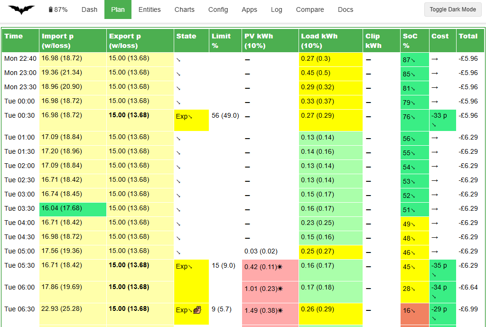

# Output data

Each time Predbat runs it outputs a lot of information about the current performance of your solar/battery system and the predicted load, PV, cost, CO2, car charging, etc.

This section of the documentation explains the different output and logging data that Predbat produces and gives an overview of how to display that information within Home Assistant.
There can never be a single Predbat dashboard that suits every user, so instead Predbat gives a starter set of displays that can be adapted to your individual needs.

## Web interface

The [Predbat Web Interface](web-interface.md) provides an easy to use way to see and change different aspects of your Predbat system including view the current plan, adjust the configuration, view the charts, check your apps.yaml and view the logfiles.



## Displaying output data

Each Predbat configuration item is named *input_number.predbat_xxx*, *switch.predbat_yyy* or *select.predbat_zzz* depending on the control type.

### Creating a simple Predbat dashboard

Each time Predbat runs it auto-generates a dashboard with the filename **predbat_dashboard.yaml** that can be used as a starter for your own Predbat dashboard.
Depending on how you installed Predbat this predbat_dashboard.yaml file will be held in one of three different directories in Home Assistant:

- if you have used the [Predbat add-on installation method](install.md#predbat-add-on-install), it will be in the directory `/addon_configs/6adb4f0d_predbat/`,

- if the [combined AppDaemon/Predbat add-on installation method](install.md#appdaemon-predbat-combined-install) was used, it's in `/addon_configs/46f69597_appdaemon-predbat/`,
or

- with the [HACS, Appdaemon add-on then Predbat installation method](install.md#predbat-installation-into-appdaemon), it's `/config/appdaemon/apps/batpred/config/`.

You will need to use a file editor within Home Assistant (e.g. either the File editor or Studio Code Server add-ons) to open
the predbat_dashboard.yaml file - see [editing configuration files within Home Assistant](install.md#editing-configuration-files-in-home-assistant) if you need to install an editor.

Once opened, select and copy all the contents of the predbat_dashboard.yaml file and add the contents to a new dashboard page:

- Go to System/Dashboards, click 'Open' against an existing dashboard or 'Add Dashboard'/'New dashboard from scratch'/enter a name/click Create, then click 'Open'

- Click the pencil icon in the top right corner, click the blue 'Add card', scroll down the list of cards to the bottom and click 'Manual',
delete the template card configuration and paste the contents of the predbat_dashboard.yaml file copied earlier, then 'Save'.

This will give you a simple Predbat control and output dashboard that you can then resequence and customise as you wish.


### Creating a compact Predbat control dashboard

You can also create a dashboard page that's dynamically generated to automatically include all the Predbat control and output entities,
so when new entities are added in future Predbat releases, you don't have to edit the dashboard.

Firstly you need to [install HACS](install.md#hacs-install) if it isn't already installed, and then install two HACS front-end components:

- Auto Entities ([https://github.com/thomasloven/lovelace-auto-entities](https://github.com/thomasloven/lovelace-auto-entities))
automatically generates a list of entities that match a wildcard expression
- Lovelace Collapsable Cards ([https://github.com/RossMcMillan92/lovelace-collapsable-cards](https://github.com/RossMcMillan92/lovelace-collapsable-cards))
wraps the entity lists within a drop-down toggle

Installation steps:

- Click the HACS icon on the left-hand side panel
- Click 'Frontend'
- Click the three dots in the top right corner then 'Custom Repositories'
- Paste (or type) in the following repository name `https://github.com/RossMcMillan92/lovelace-collapsable-cards`, choose Type 'Dashboard', and click Add
- Close the Custom Repositories dialogue
- Click 'Explore & Download Repositories'
- Search for 'collapsable cards', click the name of it, check it's the right one, click 'Download', 'Download' again, then 'Reload'
- Click 'Explore & Download Repositories' again, search for 'auto-entities', then 'Download', 'Download', 'Reload'

Now create the dynamic dashboard:

- Go to Settings/Dashboards, click 'Open' against an existing dashboard or 'Add Dashboard'/'New dashboard from scratch'/enter a name/click Create, then click 'Open'
- Click the pencil icon in the top right corner, then the plus symbol on the far right of the next row to create a new View
- Enter a title of the View, then Save
- Click the blue 'Add card', scroll down the list of cards to the bottom and click 'Manual',
delete the template card configuration and copy/paste the following YAML into the dashboard and click 'Save':

```yaml
type: vertical-stack
title: Predbat 🦇
cards:
  - type: entities
    entities:
      - entity: predbat.status
      - type: weblink
        name: Predbat Web Console
        url: /hassio/ingress/6adb4f0d_predbat
      - entity: update.predbat_version
      - entity: select.predbat_update
      - entity: select.predbat_mode
      - entity: select.predbat_saverestore
      - entity: switch.predbat_active
  - type: custom:collapsable-cards
    title: 🔀 Control
    defaultOpen: false
    cards:
      - type: custom:collapsable-cards
        title: 🔢 Input Variables
        defaultOpen: false
        cards:
          - type: custom:auto-entities
            card:
              type: entities
            filter:
              include:
                - entity_id: input_number.predbat*
              exclude: []
            unique: true
            sort:
              method: friendly_name
              numeric: false
      - type: custom:collapsable-cards
        title: 🔀 Switches
        defaultOpen: false
        cards:
          - type: custom:auto-entities
            card:
              type: entities
            filter:
              include:
                - entity_id: switch.predbat*
              exclude: []
            unique: true
            sort:
              method: friendly_name
              numeric: false
      - type: custom:collapsable-cards
        title: 🔢 Selectors
        defaultOpen: false
        cards:
          - type: custom:auto-entities
            card:
              type: entities
            filter:
              include:
                - entity_id: select.predbat*
              exclude: []
            unique: true
            sort:
              method: friendly_name
              numeric: false
  - type: custom:collapsable-cards
    title: '#️⃣ Sensors'
    defaultOpen: false
    cards:
      - type: custom:collapsable-cards
        title: 💷 Cost Sensors
        defaultOpen: false
        cards:
          - type: custom:auto-entities
            card:
              type: entities
            filter:
              include:
                - entity_id: predbat.*cost*
                - entity_id: predbat.*rate*
                - entity_id: predbat.*metric*
              exclude:
                - entity_id: predbat.*start*
                - entity_id: predbat.*end*
                - entity_id: predbat.*duration*
            unique: true
            sort:
              method: friendly_name
              numeric: false
      - type: custom:collapsable-cards
        title: 💷 Saving Sensors
        defaultOpen: false
        cards:
          - type: custom:auto-entities
            card:
              type: entities
            filter:
              include:
                - entity_id: predbat.*saving*
              exclude:
                - entity_id: predbat.*start*
                - entity_id: predbat.*end*
                - entity_id: predbat.*duration*
            unique: true
            sort:
              method: friendly_name
              numeric: false
      - type: custom:collapsable-cards
        title: 🕛 Time/Duration Sensors
        defaultOpen: false
        cards:
          - type: custom:auto-entities
            card:
              type: entities
            filter:
              include:
                - entity_id: predbat.*start*
                - entity_id: predbat.*end*
                - entity_id: predbat.*duration*
                - entity_id: predbat.*record*
              exclude: []
            unique: true
            sort:
              method: friendly_name
              numeric: false
      - type: custom:collapsable-cards
        title: ⚡ Power Sensors
        defaultOpen: false
        cards:
          - type: custom:auto-entities
            card:
              type: entities
            filter:
              include:
                - entity_id: predbat.*soc*
                - entity_id: predbat.*energy*
                - entity_id: predbat.*load*
                - entity_id: predbat.*battery*
                - entity_id: predbat.*kw*
                - entity_id: predbat.*power*
                - entity_id: predbat.*charge*
                - entity_id: predbat.*iboost*
                - entity_id: predbat.*grid*
                - entity_id: sensor.predbat_pv*
              exclude:
                - entity_id: predbat.*savings*
                - entity_id: predbat.*start*
                - entity_id: predbat.*end*
                - entity_id: predbat.*duration*
                - entity_id: predbat.*record*
            unique: true
            sort:
              method: friendly_name
              numeric: false
      - type: custom:collapsable-cards
        title: 1️⃣ Binary Sensors
        defaultOpen: false
        cards:
          - type: custom:auto-entities
            card:
              type: entities
            filter:
              include:
                - entity_id: binary_sensor.predbat*
              exclude: []
            unique: true
            sort:
              method: friendly_name
              numeric: false
```

This will give you a compact dynamically created list of all Predbat entities which groups the entities by type and is collapsed by default to prevent screen clutter.


Credit @DJBenson for the code.

### Viewing the Predbat plan

- **predbat.plan_html** - A sensor that contains an HTML render of the Predbat predicted best plan, detailing import and export rates, predicted house load, solar generation, any solar clipping,
battery SoC, car and iBoost charging, and Predbat's planned charging and discharging activities.

The plan is contained in the 'html' attribute, and its recommended to [Create the Predbat Plan card](predbat-plan-card.md) as an easy way to see the plan that Predbat has created.

The sensor also contains the 'text' attribute which gives a HTML formatted brief text description of the Predbat plan, and the 'raw' attribute which repeats the plan data but in raw (unformatted) JSON format.

If you are using the Predbat add-on or docker then the Predbat plan can also be viewed via the ['Plan' view of the Predbat web interface](web-interface#plan-view), and the text description via the ['Dash' view](web-interface.md#dash-view).

### Graphing the Predbat predictions

A set of Apex Charts can also be created to see graphically what Predbat plans to do - [Creating the charts](creating-charts.md).  Renditions of the key charts can also be seen in the ['Charts' view of the Predbat web interface](web-interface.md#charts-view).

## Basic status

- **switch.predbat_active** - Automatically set by Predbat to On when Predbat is busy calculating or controlling your inverter,
or Off when Predbat is waiting for the next time it needs to perform a plan calculation update.
If you toggle this switch in Home Assistant it will force Predbat to perform an update now (useful for automations).

- **predbat.status** - Gives the current status & errors and logs any changes that Predbat makes to your inverter.
The different Predbat status values and their meanings are detailed in [what does Predbat do](what-does-predbat-do.md#predbat-status).


predbat.status additionally has the following attributes that are automatically populated:

- **Last updated** - date and time that Predbat last updated the plan
- **Debug** - A set of arrays containing Predbat's planned charging and discharging time windows and battery limits (in kWh)
- **Version** - version of Predbat that's running
- **Error** - binary value true or false depending upon whether Predbat is in an error status or nor

## Sensor data

Predbat outputs the values it read from your inverters as totals, this gives the current power flow:

- predbat.load_power - The current house load in Watts
- predbat.battery_power - The current power of your battery (charging or discharging) in Watts
- predbat.pv_power - The current power of your PV system in Watts
- predbat.grid_power - The current grid power flow (import or export) in Watts

## Baseline data

Predbat outputs the following sensors to predict what your battery is expected to do *over the forecast_hours duration of the plan* with no changes made by Predbat.
This is considered to be the 'baseline' plan:

NB: All of Predbat's forecasts are from midnight today to the forecast_hours duration (set in apps.yaml) into the future and shouldn't be confused with 'today' figures.

e.g. predbat.pv_energy is the actual PV energy from midnight today, and for the predicted forecast_hours (typically 48) ahead
so will be much larger than sensor.solcast_pv_forecast_today which is today's Solcast PV forecast.

- predbat.battery_cycle - Predicted baseline battery cycle in kWh (total kWh processed) with attributes of the prediction every 5 minutes to the end of the plan
- predbat.battery_hours_left - The number of hours left until your home battery is predicted to run out under the baseline plan (stops at the maximum prediction time)
- predbat.car_soc - The expected charge level of your car at the end of the baseline plan. Can also be charted
- predbat.charge_end - Predicted end time of the next forced battery charging under the baseline plan
- predbat.charge_limit - Predicted baseline battery charge limit for the next charge in percent with attributes of all future battery charging times & limits
- predbat.charge_limit_kw - Predicted baseline battery charge limit for the next charge in kWh with attributes of future charging times & limits
- predbat.charge_start - Predicted start time of the next forced battery charging under the baseline plan
- predbat.duration - The duration of the prediction maximum in hours
- predbat.export_energy - Total kWh of predicted exports under the baseline plan with attributes of the predicted export kWh and their time slots
in kW per 5-minute slots to the end of the baseline plan for charting
- predbat.import_energy - Total kWh of predicted imports under baseline plan with attributes of the predicted import kWh and their time slots
- predbat.import_energy_battery - Total kWh of predicted import energy used to charge the home battery under the baseline plan
- predbat.import_energy_house - Predicted import energy used by the home under the baseline plan that is not provided by your home battery
(e.g. due to a flat battery or load above the maximum discharge rate)
- predbat.load_energy - Total kWh of predicted house load under the baseline plan with attributes of the predicted load kWh in 5-minute slots to the end of the plan
with attributes of the average instantaneous house load power in kW in 5-minute slots to the end of the plan
- predbat.metric - Total predicted cost for the baseline plan, taking account of predicted solar generation, house load, import and export rates.
Attributes contain data for charting the cost prediction in 5-minute slots to the end of the plan
- predbat.pv_energy - Predicted PV energy in kWh under the baseline plan with attributes of the predicted PV generation in kWh with time slots
- predbat.soc_kw - Predicted state of charge (in kWh) at the end of the baseline plan prediction, not very useful in itself,
but the attributes hold prediction data in 5-minute intervals which can be charted with Apex Charts (or similar)
- predbat.soc_min_kwh - Predicted lowest battery SoC value in kWh under the baseline plan with attribute of the date/time that that lowest SoC occurs at

## PV 10% Baseline data

Predbat outputs the following baseline results under the PV 10% scenario for the forecast_hours duration of the plan, these are known as the 'base10' predictions:

- predbat.base10_export_energy- Total predicted export energy in kWh for the PV 10% scenario, with attributes of the predicted export kWh and their time slots
- predbat.base10_import_energy- Total predicted import energy in kWh for the PV 10% scenario, with attributes of the predicted import kWh and their time slots
- predbat.base10_load_energy - Total predicted house load in kWh for the PV 10% scenario
- predbat.base10_metric - Total predicted cost for the PV 10% scenario, with attributes of the cost prediction in 5-minute slots to the end of the plan for charting
- predbat.base10_pv_energy - Predicted PV 10% energy in kWh with attributes of the predicted PV generation in kWh with time slots
- predbat.soc_kw_base10 - Predicted final state of charge (in kWh) of the battery,
with attributes of the predicted SoC in 5-minute time slots to the end of the plan under the PV 10% scenario, for charting

## Best Prediction data

Predbat outputs the following 'best' entities from the forecast (for the forecast_hours duration) based on the lowest cost consumption plan.
The 'best' plan in Predbat parlance is simply Predbat's lowest cost predicted plan:

- predbat.battery_cycle_best - Predicted best battery cycle in kWh (total kWh processed) with attributes of the prediction in 5-minute slots.
- predbat.battery_power_best - Sensor gives the current battery power in watts, attributes give the future prediction of battery power in 5-minute slots
- predbat.best_battery_hours_left - Predicted total number of hours of battery capacity left under the best plan
- predbat.best_charge_end - Predicted end time of the next forced battery charging under the best plan
- predbat.best_charge_limit - Predicted best battery charge limit for the next charge in percent with attributes of all future battery charging times & limits
- predbat.best_charge_limit_kw - Predicted best battery charge limit for the next charge in kWh with attributes of future charging times & limits
- predbat.best_charge_start - Predicted start time of the next forced battery charging under the best plan
- predbat.best_export_end - Predicted end time of the next forced battery export under the best plan
- predbat.best_export_limit - Predicted best battery export limit in percent (will be 0% when discharging or 100% when not)
with attributes of all future battery exports (kWh and time slots)
- predbat.best_export_limit_kw - Predicted best battery export limit in kWh
- predbat.best_export_start - Predicted start time of the next forced battery export under the best plan
- predbat.best_export_energy - Total kWh of predicted exports under the best plan, with attributes of the predicted export kWh and their time slots
- predbat.best_import_energy - Total kWh of predicted imports under the best plan, with attributes of the predicted import kWh and their time slots
- predbat.best_import_energy_battery - Total kWh of predicted import energy to charge the home battery under the best plan
- predbat.best_import_energy_house - Total kWh of predicted import energy used directly by the house under the best plan
(e.g. due to a flat battery or the house load is greater than the max discharge rate)
- predbat.best_load_energy - Total kWh of predicted house load energy in kWh under the best plan with attributes of the predicted load kWh in 5 minute slots to the end of the plan
- predbat.best_metric - Total predicted cost for the best plan, taking account of predicted solar generation, house load, import and export rates.
Attributes contain data for charting the cost prediction in 5-minute slots to the end of the plan
- predbat.best_pv_energy - Predicted PV energy in kWh under the best plan with attributes of the predicted PV generation in kWh with time slots
- predbat.best_soc_min_kwh - Predicted lowest battery SoC value in kWh under the best plan with attribute of the date/time that that lowest SoC occurs at
- predbat.car_soc_best - See [Car data](#car-data) below
- predbat.carbon_best - See [Carbon data](#carbon-data) below
- predbat.grid_power_best - The sensor gives the current grid power in Watts, attributes contain future prediction of battery power in 5 minute slots.
in kW per 5 minute slots to the end of the best plan for charting
- predbat.iboost_best - See [iBoost data](#iboost-solar-diverter-data) below
- predbat.load_power_best - Gives the current grid power in W, attributes contain the predicted house load over time.
with attributes of the average instantaneous house load power in kW in 5-minute slots to the end of the plan
- predbat.pv_power_best - Gives the current PV power in Watts, attributes contain the predicted PV power in kW per 5-minute slots to the end of the best plan for charting
- predbat.soc_kw_best - Predicted final state of charge (in kWh) with attributes of the predicted SoC in 5-minute time slots to the end of the best plan, for charting
- predbat.soc_kw_best_h1 - Single data point for the predicted state of charge in 1 hour (useful for calibration charts, predicted vs actual)
- predbat.soc_kw_best_h8 - Single data point for the predicted state of charge in 8 hours (useful for calibration charts, predicted vs actual)
- predbat.soc_kw_best_h12 - Single data point for the predicted state of charge in 12 hours (useful for calibration charts, predicted vs actual)

## Best PV 10% Prediction data

Predbat outputs the following best results under the PV 10% scenario for the forecast_hours duration, these are known as the 'best10' prediction:

- predbat.best10_metric - Predicted best cost in pence using the PV 10% solar forecast
- predbat.best10_export_energy- Predicted best export energy in kWh for PV 10%
- predbat.best10_import_energy- Predicted best import energy in kWH for PV 10%
- predbat.best10_load_energy - Predicted best load energy in kWh for PV 10%
- predbat.best10_pv_energy - Predicted best PV 10% energy in kWh
- predbat.soc_kw_best10 - As soc_kw_best but using the PV 10%, also holds minute-by-minute data (in attributes) to be charted

## In-day load adjustment data

The following sensors are used in the in-day adjustment chart - see [creating the Predbat charts](creating-charts.md) and [in-day load adjustment](customisation.md#battery-margins-and-metrics-options):

- predbat.load_energy_actual - Total kWh of house load to end of plan, energy up to 'now' taken from today's actual energy, energy after 'now' from Predbat's prediction.
Attributes of this actual/predicted energy in 5-minute slots from midnight today to the end of the plan for charting
- predbat.load_energy_adjusted - Total kWh of predicted house load to end of the plan, adjusted based on variance of today's actual load
to the predicted load (based on historical data), dampened according to input_number.predbat_metric_inday_adjust_damping.
Attributes contain the 5-minute slot forecasts to the end of the plan for charting
- predbat.load_energy_predicted - Total predicted kWh of house load to end of plan, attributes of predicted load in 5-minute slots from midnight today to the end of the plan for charting
- predbat.load_inday_adjustment - the % in-day adjustment factor used to adjust Predbat's predicted load by the actual load today.
After midnight when insufficient data is available, this blends yesterday's final adjustment factor with today's developing factor:
    - **0-3 hours**: Uses 100% of yesterday's adjustment factor
    - **3-24 hours**: Blend of yesterday's adjustment factor with today's

  Additional attributes available:
    - `yesterday_adjustment`: Yesterday's final in-day adjustment factor as a percentage
    - `yesterday_weight`: The current blend weight applied to yesterday's factor as a percentage (100% at midnight, decreasing to 0% by 8 hours)

## 'Today' energy data

The following sensor's output by Predbat give the 'today' energy readings.
They mirror input sensors fed into Predbat in apps.yaml and are used in the data prediction chart - see [creating the Predbat charts](creating-charts.md):

- predbat.export_energy_h0 - Mirrors the export_today sensor configured in apps.yaml and gives today's total kWh of export energy
- predbat.import_energy_h0 - Mirrors the import_today sensor configured in apps.yaml and gives today's total kWh of import energy
- predbat.load_energy_h0 - Mirrors the load_today sensor configured in apps.yaml and gives today's total kWh of house load energy.
Note that if you have configured [load scaling](customisation.md#scaling-and-weight-options) then load_energy_h0 will have been scaled by the scaling factor.
- predbat.pv_energy_h0 - Mirrors the pv_today sensor configured in apps.yaml and gives today's total kWh of generated PV energy
- predbat.soc_kw_h0 - Mirrors the soc_kwh sensor configured in apps.yaml and gives today's total kWh of battery state of charge (SoC).
Note that if you have configured [battery scaling](apps-yaml.md#battery-size-scaling) then soc_kw_h0 will have been scaled by the configured scaling factor

## Battery status

The following sensors are set based on what Predbat is currently controlling the battery to do:

- binary_sensor.predbat_charging - Set to 'on' when Predbat is force charging the battery (from solar, or if that is insufficient, from grid import), or 'off' otherwise
- binary_sensor.predbat_exporting - Set to 'on' when Predbat is force discharging the battery for export income, 'off' otherwise.

These are useful for automations if for example, you want to turn off car charging when the battery is being exported.

## Export trigger

- binary_sensor.predbat_export_trigger_NAME - custom binary sensors that are set to On by Predbat when more than a specified amount of energy is being exported - see [Triggers in apps.yaml](apps-yaml.md#triggers)

## Prediction window

- predbat.record - The sensor is always zero; attributes contain the time window for the current predicted plan

## Energy rate data

### Low-rate import entities

- predbat.low_rate_cost - The lowest import rate cost in Pence
- predbat.low_rate_duration - The time duration in minutes of the next low rate slot
- predbat.low_rate_end - End time of the next low import rate slot
- predbat.low_rate_start - Start time of the next low import rate slot
- predbat.low_rate_cost_2, predbat.low_rate_end_2, predbat.low_rate_start_2 - The cost and times of the following low import rate slot
- binary_sensor.predbat_low_rate_slot - A sensor that is 'on' to indicate when there is a low energy rate import slot active, 'off' otherwise

### High-rate export entities

- predbat.high_rate_export_cost - The highest export rate cost in Pence
- predbat.high_rate_export_duration - The time duration in minutes of the next high rate slot
- predbat.high_rate_export_end - End time of the next high export rate slot
- predbat.high_rate_export_start - Start time of the next high export rate slot
- predbat.high_rate_export_cost_2, predbat.high_rate_export_end_2, predbat.high_rate_export_start_2 - The cost and times of the following high export rate slot
- binary_sensor.predbat_high_rate_export_slot - A sensor that is 'on' to indicate when there is a high export rate slot active, 'off' otherwise

### Other rate entities

- predbat.rates - The current energy import rate in Pence with attributes of yesterday's, today and tomorrow's rates which can be charted
- predbat.rates_export - The current energy export rates in Pence (also can be charted)
- predbat.rates_gas - The current gas rates in Pence (also can be charted)
- predbat.cost_today - The total cost of energy so far today (since midnight) with attributes of the total cost every 5 minutes since midnight today
- predbat.cost_today_export - Same as predbat.cost_today, but for all export income since midnight today
- predbat.cost_today_import - Same as predbat.cost_today, but for all import costs since midnight today
- predbat.cost_hour - The total cost of energy averaged over the last hour
- predbat.cost_today_export - Same as predbat.cost_hour, but for export
- predbat.cost_today_import - Same as predbat.cost_hour, but for import
- predbat.ppkwh_today - The cost in pence/kWh of the house load today accounting for the change in battery level
- predbat.ppkwh_hour - The cost in pence/kWh of the house load averaged over the last hour, accounting for the change in battery level

## Inverter data

Some inverters store inverter settings in [flash memory that can have a limited number of write cycles](caution.md#flash-memory) so Predbat counts the commands that it sends to the inverter so you can keep track of this:

- predbat.inverter_register_writes is the incrementing total number of writes across all inverters

If you want to create a utility meter to record daily inverter register writes, add the following to your `configuration.yaml` (NB: the utility meter has to be defined in YAML, it cannot be configured via the HA User Interface):

```yaml
utility_meter:
  # Predbat daily inverter writes utility meter
  predbat_daily_inverter_writes:
    source: predbat.inverter_register_writes
    name: Predbat Daily Inverter Writes
    unique_id: predbat_daily_inverter_writes
    cycle: daily
```

Add a card of type 'markdown' to your dashboard to display a simple dashboard of inverter writes:

```yaml
type: markdown
content: >-
  {% set dd = (as_timestamp(now()) - as_timestamp("2024-12-22 17:20:00")) | timestamp_custom("%j")| int %}
  
  {{ dd }} days, total {{ tw }} inverter writes

  {{ states('sensor.predbat_daily_inverter_writes')|int }} writes today

  Average {{ (tw / dd ) | int }} writes per day
```

You'll need to change the hard-coded timestamp "2024-12-12..." to the date/time you first started counting Predbat inverter writes from to get the number of days and average writes per day correct.

## Car data

- binary_sensor.predbat_car_charging_slot - A binary sensor indicating when to charge your car (if car planning is enabled) - which can be used in an automation
as described in [Predbat led car charging](car-charging.md#car-charging-planning)
- predbat.car_charging_start - The time that car charging is planned to start at, in HH:MM:SS format
- predbat.car_soc_best - Predicted charge level of your car in the best plan at the end of the plan using the proposed car charging SoC% and charge window. Can also be charted
- predbat.cost_today_car - Current cost in pence so far today of charging the car, with attribute of the projected future car charging costs and slots
- predbat.cost_total_car - A running total in pence of the below cost_yesterday_car sensor, with attribute of the total in pounds
- predbat.cost_yesterday_car - A sensor that gives the total energy costs in pence of charging the car for yesterday (00:00-23:59 on the previous day)

## iBoost Solar Diverter data

- binary_sensor.predbat_iboost_active - A binary sensor indicating when there is excess solar and the solar diverter (e.g. iBoost, Eddi or just plain immersion heater) should be active,
can be used for automations to trigger the immersion heater boost
- input_number.predbat_iboost_today - Gives the amount of energy modelled that will be sent to the solar diverter today,
increments during the day and is reset to zero at 11:30pm each night
- predbat.iboost_best - Predicted energy in kWh going into the iBoost solar diverter under the best plan

You can use the iboost_best sensor to create a custom template sensor that gives the time to next planned iBoost:

```yaml








{{ (as_timestamp (times[ni])-as_timestamp (now()) ) / 3600 | round (0) }}




{{100}}

```

If no iBoost is imminent then the sensor is set to 100h, and if currently boosting it will produce a small negative answer.

Thanks to @mogons57 for the template sensor code.

## Carbon data

The following sensors output by Predbat give historic and predicted carbon data.
They are used in the carbon chart - see [creating the Predbat charts](creating-charts.md).

- predbat.carbon - Predicted Carbon energy in g at the end of the plan with attributes giving the breakdown of predicted Carbon impact by half hour time slots
- predbat.carbon_best - Predicted Carbon intensity in g for your home under the best plan based on grid imports, grid exports and the grid's projected carbon intensity
- predbat.carbon_now - A sensor that gives the current Grid Carbon intensity in g/kWh
- predbat.carbon_today - A sensor that tracks your home's Carbon impact today in g based on your grid import minus your grid export

## Cost saving data

The following sensors output by Predbat give cost-saving data that Predbat achieved, i.e. the financial benefits of using Predbat.
They are used in the daily cost-saving and total cost-savings charts - see [creating the Predbat charts](creating-charts.md):

- predbat.cost_yesterday - A sensor that gives the total energy costs in pence for yesterday (00:00-23:59 on the previous day)
- predbat.savings_total_actual - A running total in pence of the above cost_yesterday sensor, with attribute of the total in pounds
- predbat.savings_total_predbat - A running total in pence of the below savings_yesterday_predbat sensor, with attribute of the total in pounds
- predbat.savings_total_pvbat - A running total of the below savings_yesterday_pvbat sensor, with attribute of the total in pounds
- predbat.savings_total_soc - A running total of what the final SoC in kWh would have been at the end of each day if you were not using Predbat
- predbat.savings_yesterday_predbat - A sensor which tells you how much money Predbat saved you yesterday compared to not using Predbat,
and only charging at the lowest import rate in the 24 hour period
- predbat.savings_yesterday_pvbat - A sensor which tells you how much money you saved from using Predbat
vs not having a PV and battery system at all and all house load being met from grid import

Note: The savings using Predbat are calculated by default compared to having one fixed nightly charge slot set to charge at the lowest import rate with a target of 100%
You can change the number of simulated charge slots in apps.yaml by setting **calculate_savings_max_charge_slots** to the number of slots to allow.
If set to 0 then Demand (ECO) mode will be used as the baseline or if non-zero then the maximum number of slots can be set (e.g. 2).

## Solar forecast data

The following sensors give the forecast Solar data from Solcast.
Predbat populates these sensors irrespective of whether you are using the [Predbat direct Solcast or Solcast integration method](install.md#solcast-install) to get your Solar forecast,
but if you are using the Solcast integration then the Predbat sensors mirror the similarly named Solcast integration sensors so could be disabled if you so wish.

- sensor.predbat_pv_today - Tracks the PV forecast in kWh for today, attributes give the total today, remaining amount today and the half-hourly data
- sensor.predbat_pv_tomorrow - Tracks the PV forecast in kWh for tomorrow, attributes give the total today, remaining amount today and the half-hourly data
- sensor.predbat_pv_d2 - Similar to the above, but tracking the PV forecast for the day after tomorrow
- sensor.predbat_pv_d3 - PV forecast for two days after tomorrow
- sensor.predbat_pv_forecast_h0 - Tracks the PV 'power now' forecast in Watts, attributes give the 10% and 90% power now forecast

The solar sensor attributes include:

- total - total PV forecast for the day
- total10 - total PV 10% forecast for the day
- total90 - total PV 90% forecast for the day
- totalCL - total calibrated PV forecast for the day, this is the PV forecast adjusted by Predbat based on historical forecast vs generation data. The calibration should take account of shading or panel performance issues
- remaining/remaining10/remaining90/remainingCL - forecast solar generation for the remainder of the day
- detailedForecast - a half hourly breakdown of solar forecast for the day, with similar PV estimate, 10% estimate, 90% estimate and calibrated estimate values

## Dummy inverter sensors

Predbat can now manage different inverter types, some of which don't have all the same control characteristics. Predbat might create dummy entities for control aspects that your inverter doesn't natively support.

For example, for each Gen 1 hybrid inverter (N=0, 1, etc if there are multiple inverters), Predbat creates the following dummy inverter entities:

- sensor.predbat_ge_N_idle_end_time
- sensor.predbat_ge_N_idle_start_time
- sensor.predbat_ge_N_scheduled_discharge_enable

These sensors can be ignored and excluded from the recorder history if you wish.

## Alert data

- sensor.predbat_alertfeed_status - Gives you data on the currently active weather alert (if configured) and in the attributes a list of all active alerts with their details

## Predbat Logfile

Predbat writes detailed logging, status and progress activity information to a logfile as it runs and so this file should be checked if **predbat.status** reports an error,
or if you want to verify that Predbat is running OK.

There is a lot of output in the logfile, this is normal!

If you are using the Predbat add-on then the logfile can easily be viewed via the 'Log' tab of the [Predbat web interface](web-interface.md#log-view).

To directly view the physical logfile, it can be found in one of three different directories in Home Assistant with slightly different filenames depending on how you installed Predbat:

- if you have used the [Predbat add-on installation method](install.md#predbat-add-on-install), the logfile will be `/addon_configs/6adb4f0d_predbat/predbat.log`,

- if the [HACS, Appdaemon add-on then Predbat installation method](install.md#predbat-installation-into-appdaemon), it's `/homeassistant/appdaemon/appdaemon.log`, or

- if the combined AppDaemon/Predbat add-on installation method was used, it's `/addon_configs/46f69597_appdaemon-predbat/predbat.log`.

You will need to use a file editor within Home Assistant (e.g. either the File editor or Studio Code Server add-ons)
to view Predbat's logfile if you are not using the Predbat add-on.
See [editing configuration files within Home Assistant](install.md#editing-configuration-files-in-home-assistant) if you need to install an editor.

## Automated monitoring that Predbat and GivTCP are running OK

With GivTCP and Predbat performing an important function, managing your battery charging and discharging to best reduce your electricity bills,
you may find these automations useful to monitor that GivTCP and Predbat are running OK, and if not, to raise an alert on your mobile device running the Home Assistant Companion app.

To create a new automation:

- Settings / Automations & Scenes
- Create Automation / Create new Automation
- Three dots (top right corner) / Edit in YAML
- Delete the existing (template) automation code and copy/paste the supplied automation code below

### GivTCP activity monitor

This automation will raise an alert if any of the following occur:

- The inverter goes offline for more than 15 minutes
- No last_updated_time received from the inverter for more than 15 minutes
- Inverter temperature less than 5 degrees for more than 15 minutes (should never happen)
- The battery goes offline to the inverter for more than 15 minutes
- GivTCP add-on is not running
- Mosquitto broker add-on is not running
- Predbat/AppDaemon-predbat or AppDaemon add-on (as appropriate) is not running

The script will need to be customised for your inverter ID, battery ID and mobile details,
and can be extended for multiple inverters and batteries by duplicating the triggers and adding appropriate battery and inverter IDs.

```yaml
alias: GivTCP activity monitor
description: Alert when communications to GivTCP have ceased for 15 minutes
triggers:
  - trigger: state
    entity_id: sensor.givtcp_<inverter id>_last_updated_time
    to: "null"
    for:
      minutes: 15
    variables:
      alert_text: No GivTCP update received from inverter <id>
      restart_app: GivTCP
  - trigger: state
    entity_id:
      - sensor.givtcp_<inverter id>_status
    from: online
    for:
      minutes: 15
    variables:
      alert_text: No GivTCP update received from inverter <id>
      restart_app: GivTCP
  - trigger: numeric_state
    entity_id:
      - sensor.givtcp_<inverter id>_invertor_temperature
    for:
      minutes: 15
    below: 10
    variables:
      alert_text: No GivTCP update received from inverter <id>
      restart_app: GivTCP
  - trigger: state
    entity_id:
      - sensor.givtcp_<battery id>_battery_cells
    to: unknown
    for:
      minutes: 15
    variables:
      alert_text: Battery <battery_id> is offline to GivTCP
      restart_app: GivTCP
  - trigger: state
    entity_id:
      - binary_sensor.givtcp_running
    to: "off"
    for:
      minutes: 15
    variables:
      alert_text: GivTCP add-on is not running
      restart_app: GivTCP
  - trigger: state
    entity_id:
      - binary_sensor.mosquitto_broker_running
    to: "off"
    for:
      minutes: 15
    variables:
      alert_text: Mosquitto Broker add-on is not running
      restart_app: Mosquitto
actions:
  - action: notify.mobile_app_<your mobile device id>
    alias: Send a notification
    data:
      title: GivTCP communication issue
      message: |
        {{now().strftime('%-d %b %H:%M')}} ISSUE:
        {{ alert_text }} for the past 15 minutes, restarting
        {{ restart_app }}
      data:
        visibility: public
        persistent: true
        push:
          sound:
            name: default
            critical: 1
            volume: 0.8
          sticky: true
          color: red
  - choose:
      - conditions:
          - condition: template
            value_template: "{{ restart_app == 'GivTCP' }}"
        sequence:
          - alias: Restart GivTCP add-on
            action: hassio.addon_restart
            data:
              addon: 533ea71a_givtcp
      - conditions:
          - condition: template
            value_template: "{{ restart_app == 'Mosquitto' }}"
        sequence:
          - alias: Restart Mosquitto add-on
            action: hassio.addon_restart
            data:
              addon: core_mosquitto
trace:
  stored_traces: 20
mode: single
```

The last two triggers (GivTCP and Mosquitto running) trigger if any of these add-ons that Predbat is dependent upon are not running.
You will need to enable a binary sensor for each add-on to be able to use these triggers in the automation:

- Navigate to Settings / Devices and Services / Devices and search for 'GivTCP'
- Click on the GivTCP add-on, and under 'Sensors', click 'XX entities not shown'
- Click the 'Running' sensor, then the cogwheel, and Enable the sensor

Repeat these steps for the 'Mosquitto' add-on.

As an extension to the above, if you don't want the automation to restart the failing add-on and instead just send an alert that there is a problem, delete the 'choose' code above.
Restarting GivTCP does however lose the current GivTCP log-in Home Assistant.

NB: If you are using GivTCP v2 rather than v3, replace the '533ea71a_givtcp' with 'a6a2857d_givtcp'.

### Predbat error monitor

This automation will raise an alert if Predbat's status turns to *Error* for more than 5 minutes.

In normal operation, Predbat will automatically run and update its forecast every 5 minutes. If the automation detects that Predbat has not done this for 20 minutes,
then an alert will be raised and the automation will restart the Predbat add-on to try to resolve a 'hung Predbat' issue.

In the same way for the GivTCP and Mosquitto add-ons above, the last trigger requires you to enable a binary sensor that detects that the Predbat/AppDaemon add-on is running.
Follow the same steps to enable the binary sensor for either the 'Predbat', 'AppDaemon' or 'AppDaemon-predbat' add-on depending on which Predbat installation method you followed.

The script will need to be customised for your mobile details.

```yaml
alias: Predbat error monitor
description: Alert when Predbat has raised an exception
trace:
  stored_traces: 50
triggers:
  - trigger: template
    alias: Predbat status contains 'Error' for 10 minutes
    value_template: "{{ 'Error' in states('predbat.status') }}"
    for:
      minutes: 10
    variables:
      alert_text: >-
        Predbat status is {{ states('predbat.status') }}, error={{
        state_attr('predbat.status', 'error') }}
  - trigger: state
    alias: Predbat is in error status for 10 minutes
    entity_id: predbat.status
    attribute: error
    to: "true"
    for:
      minutes: 10
    variables:
      alert_text: >-
        Predbat status is {{ states('predbat.status') }}, error={{
        state_attr('predbat.status', 'error') }}
  - trigger: state
    alias: Predbat status.last_updated has not changed for 20 minutes
    entity_id: predbat.status
    attribute: last_updated
    for:
      minutes: 20
    variables:
      alert_text: >-
        Predbat last_updated=' {{
        state_attr('predbat.status','last_updated')|as_timestamp|timestamp_custom('%a
        %H:%M') }}', unchanged for 20 mins; Status='{{ states('predbat.status')
        }}', restarting
      restart_predbat: "Y"
  - trigger: state
    alias: Predbat add-on not running for 15 minutes
    entity_id: binary_sensor.predbat_running
    to: "off"
    for:
      minutes: 15
    variables:
      alert_text: Predbat add-on is not running, restarting
      restart_predbat: "Y"
  - trigger: state
    alias: predbat_active stuck on for 20 minutes
    entity_id:
      - switch.predbat_active
    for:
      minutes: 20
    variables:
      alert_text: Predbat active has been stuck on (updating the plan) for 20 minutes, restarting
      restart_predbat: "Y"
  - trigger: template
    alias: Predbat entities not populated for 20 minutes
    value_template: "{{ states('predbat.plan_html') == 'unknown' }}"
    for:
      minutes: 20
    variables:
      alert_text: >-
        Predbat plan is unknown for 20 minutes, possibly failed on startup,
        restarting
      restart_predbat: "Y"
  - alias: "Heartbeat: check predbat has populated output entities OK"
    trigger: time_pattern
    minutes: /30
    id: heartbeat
actions:
  - alias: Heartbeat, check predbat output variables are populated
    if:
      - condition: trigger
        id:
          - heartbeat
    then:
      - if:
          - condition: template
            value_template: "{{states('predbat.plan_html') == 'unknown' }}"
        then:
          - variables:
              alert_text: >-
                Predbat has not populated its output entities, possibly failed
                on startup, restarting
              restart_predbat: "Y"
        else:
          - stop: "Heartbeat check: Predbat plan is populated, all is OK"
  - action: notify.mobile_app_<your mobile device id>
    alias: Send alert message
    data:
      title: Predbat status issue
      message: |
        {{now().strftime('%-d %b %H:%M')}} ISSUE:
        {{ alert_text }}
      data:
        visibility: public
        persistent: true
        push:
          sound:
            name: default
            critical: 1
            volume: 0.8
        sticky: true
        color: red
  - if:
      - condition: template
        value_template: "{{ restart_predbat == 'Y' }}"
    then:
      - action: hassio.addon_restart
        data:
          addon: 6adb4f0d_predbat
        alias: Restart Predbat add-on
mode: single
```

NB: If you are using AppDaemon rather than the Predbat add-on, replace '6adb4f0d_predbat' with 'a0d7b954_appdaemon' and change 'binary_sensor.predbat_running' to 'binary_sensor.appdaemon_running'.

An error alert looks like this:


