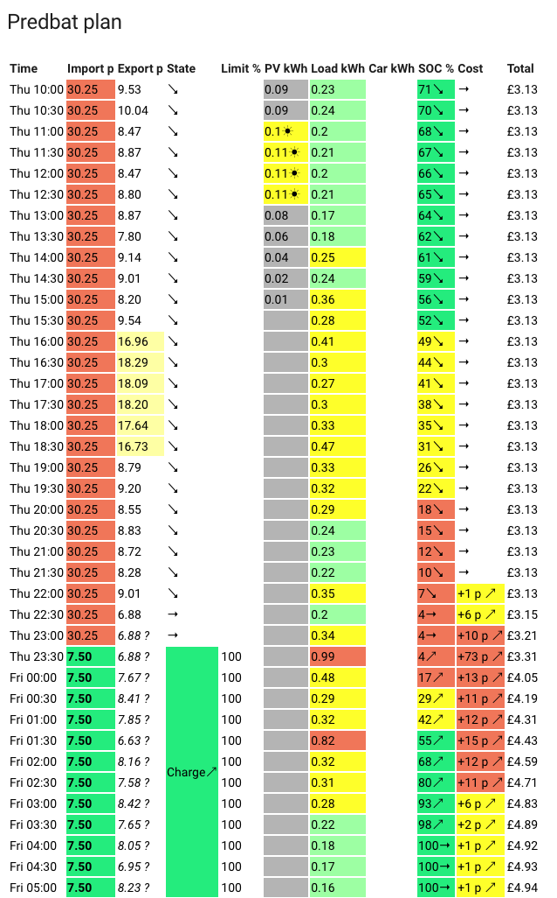
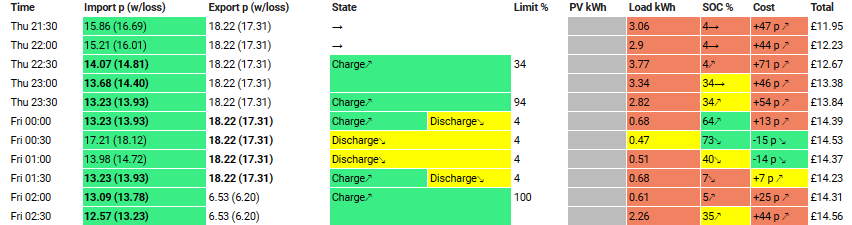

# Predbat Plan card

Predbat can create its own plan card which can be added to your Home Assistant dashboard.

At a glance the Predbat plan shows you the plan going forward of home demand, EV charging, iBoost and for your battery, and any actions that Predbat plans to take.

## Displaying the Predbat plan

Firstly install the [HTML template card](https://github.com/PiotrMachowski/Home-Assistant-Lovelace-HTML-Jinja2-Template-card) in HACS:

- In HACS, click on Frontend
- Click the blue *Explore and download repositories* button and type 'HTML'
- Click on 'HTML Jinja2 Template card', then click the blue 'Download', then 'Download' again to install it
- When prompted to 'reload your browser', click 'Reload'

*NB: Do not install the very similarly named 'Lovelace Html card', it won't work!  You must install 'HTML Jinja2 Template card'.*

Next, on a Home Assistant dashboard, click the blue 'Add card', scroll down the list of cards to the bottom and click 'Manual',
delete the template card configuration and copy/paste the following to display the Predbat plan:

```yaml
type: custom:html-template-card
title: Predbat plan
ignore_line_breaks: true
content: |
  {{ state_attr('predbat.plan_html', 'html') }}
```

You should see something like this:



If you get an error 'Custom element doesn't exist: html-template-card' then you've not installed the Jinja2 template card correctly from HACS.

## Understanding the Predbat plan

For every half hour period (slot) that Predbat has planned for (the *forecast_hours* setting in `apps.yaml`), the Predbat plan shows:

- The import rate in pence for that slot
- The export rate in pence for that slot
- What 'status' predbat will be in (e.g. Charging, Discharging)
- Any limit applied (e.g. charging to 70%)
- Forecast Solar generation (from Solcast)
- Forecast house load (from your historical load data)
- Planned car charging (if car charging is configured in Predbat)
- Planned iBoost immersion heating (if iBoost is configured)
- What the battery SoC will be at the start of the 30 minute slot
- The forecast cost for the half hour slot
- A running total cost

Rate symbols (import and export):

- ? &#8518; - Rate that has been modified based on **input_number.predbat_metric_future_rate_offset_import** or **input_number.predbat_metric_future_rate_offset_export**
- ? &#x2696; - Rate that has been estimated using future rate estimation data (e.g. Nordpool)
- &#61; - Rate that has been overridden by the users apps.yaml
- &#177; - Rate that has been adjusted with a rate offset in the users apps.yaml
- &dollar; - Rate that has been adjusted for an Octopus Saving session
- ? - Rate that has not yet been defined and the previous days data was used instead

Battery SoC symbols:

- &rarr; - Current SoC expected to remain level
- &searr; - Current SoC expected to fall
- &nearr; - Current SoC expected to rise

Cost symbols:

- &rarr; - Current cost expected to remain level
- &searr; - Current cost expected to fall (due to export)
- &nearr; - Current cost expected to rise (due to import or standing charge)

Explaining each column in the Predbat plan in more detail:

- **Time** - Predbat plans your home, solar and battery load in 30 minute slots, on the :00 and :30 minutes past each hour.
The Predbat slots are therefore aligned to Octopus Agile slots or rate change times on any other tariff.

- **Import** - The import rate for that time slot in pence.<BR>
The rate will be coloured Blue if the price is zero pence or negative,
Green if the rate is less than the import rate threshold,
Red if the rate is more than 1.5 times the import rate threshold,
and Yellow if the rate is between 1 and 1.5 times the import rate threshold.<BR>
See the [Predbat customisation guide](customisation.md#battery-margins-and-metrics-options) for explanation of the import rate threshold (and over-riding it), but in essence
Predbat will consider blue and green-coloured slots as preferred candidates for importing, yellow and red (higher rates) will not.<BR>
If battery charging is planned by Predbat for a particular slot, the import rate for that slot will be highlighted in bold text.

- **Export** - Similarly, the export rate for that time slot in pence.<BR>
The rate will be coloured White if the price is less than the export rate threshold,
Yellow if it is more than the export rate threshold,
and pale Red if the rate is more than 1.5 times the export rate threshold.<BR>
So in essence, Yellow and Red coloured export rates will be considered as priorities for exporting, White will not.<BR>
If battery discharging is planned by Predbat for a particular slot, the export rate for that slot will be highlighted in bold text.

- **State** - [Predbat's status](what-does-predbat-do.md#predbat-status) controls whether the battery is charging, discharging to support house load (Eco mode),
discharging and force exported, or being held at the current level.<BR>
Alongside the state is an arrow which points upwards if the battery SoC is increasing (i.e. charging), to the right if the battery SoC is remaining constant,
or downwards if the battery SoC is decreasing (i.e. discharging).<BR>
If Predbat's plan has been over-ridden and the [slot has been manually controlled](customisation.md#manual-control) to be a Charging slot, Discharging or Idle,
then alongside the State and battery SoC arrow will be an upside down 'F' indicating it is a 'Forced' activity.<BR>
The slot will be coloured Green for Charging, Yellow for Discharging, Silver Grey for Freeze Charging, Pale Blue for Hold Charging or White for Idle.<BR>
NB: The Predbat plan is shown in 30 minute time slots but Predbat actually plans battery activity in 5 minute segments within the 30 minute slot.
If the Home Assistant control *switch.predbat_calculate_discharge_oncharge* is set to True,
then within a 30 minute slot (and depending on import and export rates) Predbat could potentially plan for there to be both
charging and discharging activity - if Predbat plans this, state will show as both Charging and Discharging in the same slot.

- **Limit %** - Alongside any battery activity (charging, discharging, etc) there will be a SoC limit. This limit is what the SoC is planned to be at the end of the 30 minute time slot.
e.g. 'Charge&nearr; 70%' is charge to 70% SoC, and 'Discharge&searr; 4%' is discharge the battery to the 4% reserve level.

- **PV kWh** - The predicted solar forecast for the half hour slot, estimated from the [Solcast Forecast](apps-yaml.md#solcast-solar-forecast).<BR>
If the PV forecast is above 0.2kWh for the slot it will be coloured Melon Red with a little sun symbol, above 0.1kWh it will be Yellow with a sun symbol,
otherwise it will be Silver Grey.

- **Load kWh** - The predicted house load for the half hour slot, estimated as a weighted average of the number of [days_previous](apps-yaml.md#basics)
[Historical data](apps-yaml.md#historical-data) from your inverter or other house load sensor.<BR>
If the load forecast is 0.5kWh or above for the slot it will be coloured Orangey-Red, from 0.25kWh to 0.5 it will be coloured Yellow,
above 0 to 0.25 it will be Light Green, and if zero, it will be coloured White.

- **Car kWh** - The total predicted car charging for the half hour slot. This column will only be shown if *num_cars* in `apps.yaml` is 1 or more.<BR>
If the car is planned to be charged in that slot then the kWh will be coloured Yellow, otherwise it will be White.

- **iBoost kWh** - The energy planned for solar diverter immersion heating such as iBoost or MyEnergi Eddi. This column will only be shown if *switch.iboost_enable* is set to True.<BR>
If the solar diverter is planned to be on in that slot then the kWh will be coloured Yellow, otherwise it will be White.

- **SoC %** - The estimate of battery State of Charge percentage *at the start* of the time slot
together with an arrow pointing up, to the right or downwards to indicate whether the battery SoC is increasing, remaining constant or decreasing during the time slot.<BR>
The 'SoC %' can be read in conjunction with the 'Limit %'; the SoC column gives the estimated SoC at the beginning of the slot,
the Limit column the estimated SoC at the end of the slot.<BR>
If the SoC is 50% or greater it will be coloured Green, 20% or greater, Yellow, and if less than 20%, Orangey-Red.

- **Cost** - The estimated cost in pence for the time slot together with an arrow indicating whether the total cost today is increasing, staying flat or decreasing.<BR>
If the cost for the slot is 10p or more it will be coloured Orangey-Red, &frac12;p or more it will be coloured Yellow, -&frac12;p or less it will be coloured Green,
otherwise it will be coloured White.

- **Total** - The total cumulative cost so far for 'today' at the start of the slot, including the standing charge.
At midnight tonight this cumulative cost will be reset to the daily standing charge (or zero if metric_standing_charge wasn't set in `apps.yaml`).<BR>
Due to the way Predbat works, total cost is always reported (in Predbat output entities, this HTML plan, in the [Apex charts](creating-charts.md), etc)
as starting from midnight today and adding on from there.<BR>
Looking at the sample Predbat plan above as an example, the plan starts at 10:00 with total cost today already being £3.13. The house load is then fully met through the day and evening
by the battery (with some PV top-up charging) so total cost remains constant at £3.13.<BR>
In the 22:30 and 23:00 slots there is a little grid import, and then at 23:30 there's grid import and the battery starts to be charged.
As you can see the Total continues to increase in the plan past midnight with each Total being
the Total from the preceding slot plus the Cost estimate from the preceding slot - reminder that Total gives the running total *at the start* of the slot.<BR>
Total cost is always coloured White.

## Debug mode for Predbat Plan

If [Predbat expert mode](customisation.md#expert-mode) is turned on then a number of additional controls and switches are made available in Home Assistant.

If **switch.predbat_plan_debug** is then turned on then the Predbat plan shows additional 'debugging' information for the import and export rate columns.

The Predbat plan will now look like this with plan_debug turned on:



Import and Export rate will now show the actual rate (according to how you have setup the [energy rates](energy-rates.md)) and also in brackets the *effective* import or export rate.

The *effective rate* takes into account [battery and inverter energy losses](customisation.md#battery-loss-options) for charging and discharging and converting from DC to AC and vice-versa.
Note that the Cost and Total columns are always based upon the actual Import and Export rate.

Using the above debug plan as an example:

- At 22:30 the battery is being charged. The actual import rate is 14.07p, but after conversion losses to store the grid AC into the DC battery,
the energy being put into the battery has effectively cost 14.81p - for every 1kWh of AC grid import you don't get 1kWh of DC stored in the battery,
so 1kWh of battery charge has effectively cost slightly more than the import rate.

- At 00:30 the battery is being force discharged and excess energy (above the estimated house load of 0.47kWh) will be exported.
The actual export rate is 18.22p, but after losses converting the stored DC battery charge into AC to supply the home and export it,
the energy being exported has effectively only earned 17.31p - it will take slightly more than 1kWh of stored DC battery charge to get 1kWh of AC to use or export
so each discharged and exported kWh actually earns slightly less.

- Putting these together, at 00:00, the effective import rate (after losses) is 13.93p, the effective export rate is 17.31p,
so even though battery and inverter conversion losses have been incurred, there is still a 3.38p profit per kWh and
Predbat plans to charge and then discharge the battery in the same slot to generate that profit.

The debug mode on the Predbat plan can be quite useful to understand from the import and export rates *after conversion losses*, why Predbat plans to charge or discharge the battery.

## Customising and Reformatting the Predbat Plan

An additional independent front-end Home Assistant component the 'Predbat Table Card' is available on HACS that gives a number of additional customisation and configuration options
to tailor how the Predbat plan looks:

- Change the sequence of columns and which columns are shown in the plan
- Restyle the columns, or retain the Predbat original colour scheme
- Apply custom light/dark themes

See the [Predbat Table Card repository](https://github.com/pacemaker82/PredBat-Table-Card) for more details.
