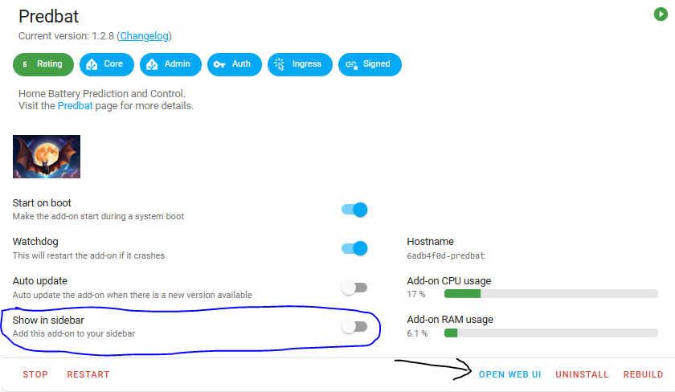
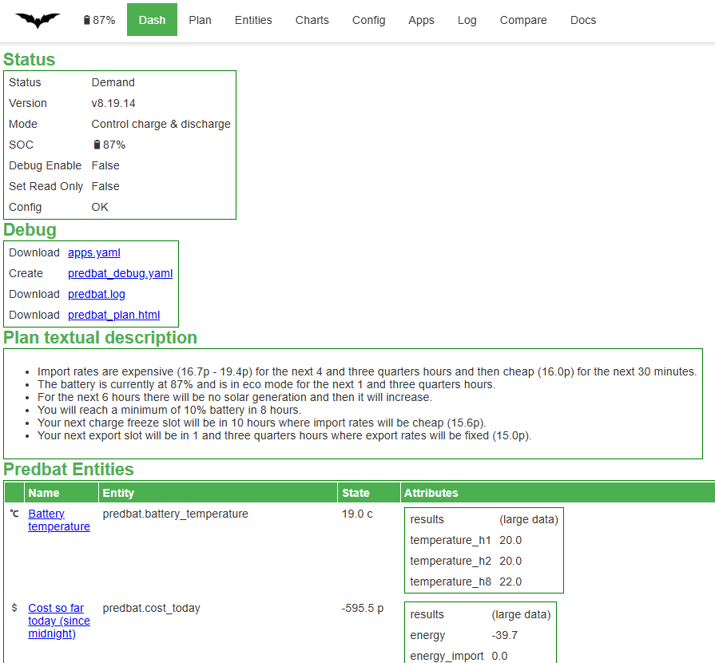
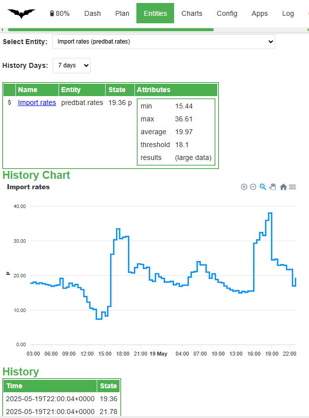
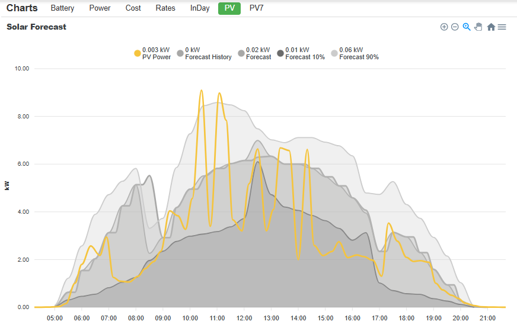
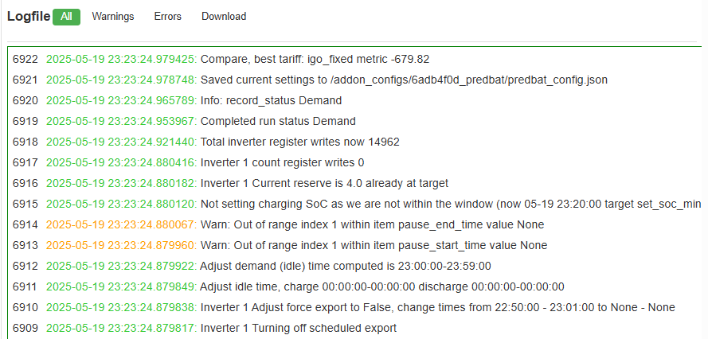
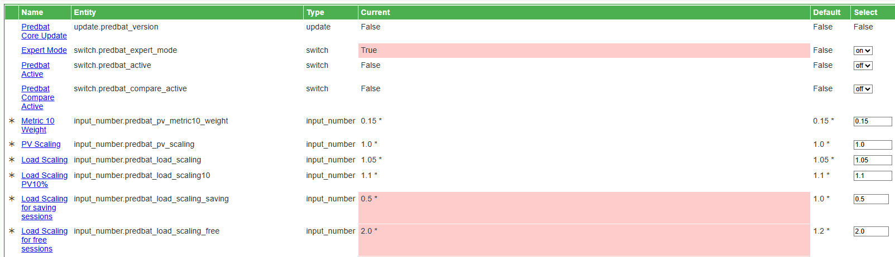
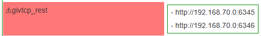
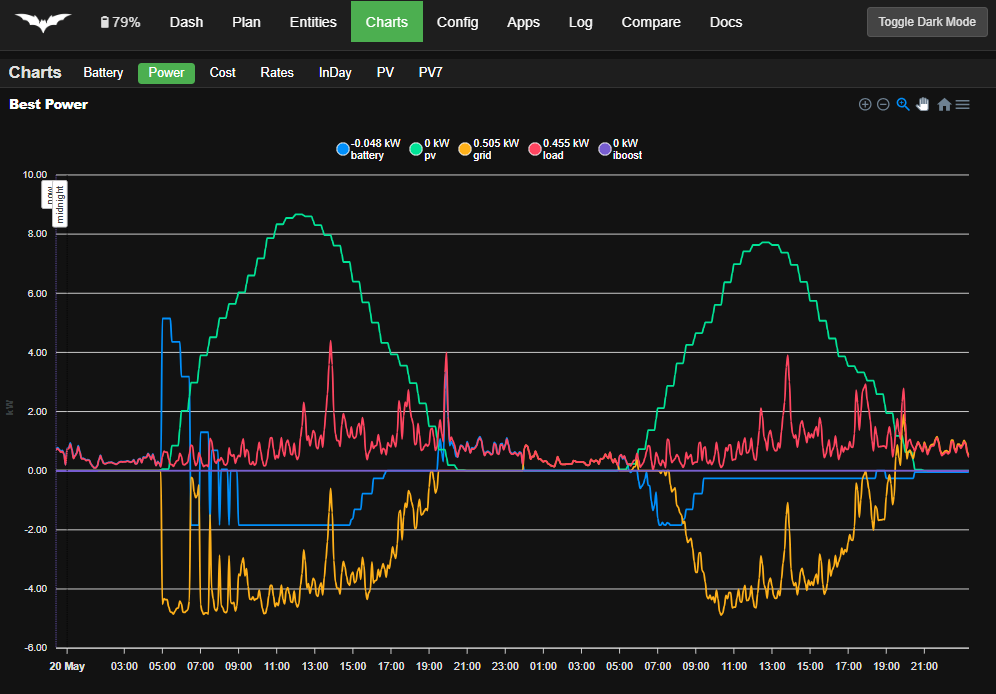

# Web Interface

The Predbat Web Interface provides an easy to use way to see and change different aspects of your Predbat system including view the current plan, adjust the configuration, view the charts, check your apps.yaml and view the logfiles.


## Accessing the Web Interface

If you are running the Predbat add-on then the Predbat Web Interface can be accessed by clicking 'Open Web UI' on the add-on screen (arrowed):



You can also turn on the 'Show in sidebar' option (circled) to have direct access to the web interface from the Home Assistant side bar.

Another option is to include a link on your dashboard using an entities card:

```yaml
  - type: entities
    entities:
      - type: weblink
        name: Predbat web interface
        url: /hassio/ingress/6adb4f0d_predbat
        icon: mdi:bat
```

If you are not using the Predbat Add-on then you may be able to access the Web Interface directly on port 5052 (e.g. with a Docker Container or native on your Linux/MAC).  The port number can be changed by setting [web_port in apps.yaml](apps-yaml.md#web-interface).

**NOTE:** The Predbat web interface will not work with the AppDaemon or the Predbat-appdaemon installation methods.

## Web Interface Views

A number of different views of Predbat are available and you can change your view using the top menu bar.

### Dash View

The initial view is the Dash view which gives a summary of Predbat's status and mode, some easy-to-access debug options (see below), a text summary of Predbat's plan, and then all the output entities that Predbat creates.



The Debug panel provides easy access to a number of files that are useful in diagnosing a problem and are usually required if you raise a [Predbat GitHub issue](https://github.com/springfall2008/batpred/issues):

- **Download apps.yaml** - provides a link to download your [apps.yaml file](apps-yaml.md). This is useful to identify issues with your Predbat configuration
- **Create predbat_debug.yaml** - turns Predbat's debug mode on and creates a Predbat debug file which contains your entire Predbat Home Assistant configuration;
all the input settings for Predbat and all Predbat's output data including the current HTML plan, the best_* entities, etc.<BR>
This debug file enables your setup to be recreated to identify any configuration issues it may have or Predbat bugs to be re-created. Confidential information such as your Solcast API or GECloud API are redacted in the debug file.
- **Download predbat.log** - provides a link to download the current [Predbat logfile](output-data.md#predbat-logfile) which contains progress and any error messages that occur whilst Predbat is running
- **Download predbat_plan.html** - provides a link to download the current [Predbat HTML plan](output-data.md#viewing-the-predbat-plan)

Note that before you can attach a downloaded apps.yaml or predbat_debug.yaml file to a GitHub issue you must rename the file extension, e.g. to '.txt', so for example `apps.txt` and `predbat_debug.txt`.
This is because GitHub does not accept .yaml file attachments.

Underneath the Debug panel is the Power Flow diagram.  The Power Flow gives an 'instantaneous Power' snapshot of your PV generation, Battery charge/discharge, Grid import/export and House consumption using the **power_xx** entities defined in `apps.yaml`.

Note these are a view of what is happening right now on your inverter and are not the same as the
'Energy Today' sensors in `apps.yaml` (load_today, import_today, export_today and pv_today) which give accumulated energy so far today and for the days_previous days history.

Beneath that is the plan textual description panel which gives a brief summary of current battery level, forthcoming import rates, solar generation, planned charging, discharging and export activity.

At the bottom of the view is the Predbat Entities panel which details all the other Predbat output entities, their current state and attributes. Any entity name can be clicked to swap to the [Entities view](#entities-view) for that entity.

### Plan View

This view provides an easy way to see what Predbat is planning for your battery/inverter. It displays the current Predbat plan in (by default) 30 minute segments showing import and export rates,
Predbat's planned state for the battery (charging, discharging, etc), predicted solar generation, predicted house load, car charging, cost, etc.


Buttons enable you to easily swap between 'Plan' which shows the current Predbat Plan from now going forwards, a 'History' view of the plan from Midnight yesterday up to now,
and 'Yesterday without Predbat' which is a simulated plan without any Predbat battery optimisation and an [assumed number of charging periods](apps-yaml.md#savings-max-charge-slots).

You can easily change Predbat's planned activity for a slot by clicking on the slot time, then selecting Manual Demand, Manual Charge, Manual Export, Manual Freeze Charge or Manual Freeze Export to set the activity.
If you have previously changed Predbat's planned activity for a slot, choose Clear to return Predbat to its planned activity.

Further details of the columns, what they show, the colour coding, etc can be found in the [Predbat plan card documentation](predbat-plan-card.md#understanding-the-predbat-plan).

You can also [create a Predbat Plan card](predbat-plan-card.md) to show Predbat's plan on your own custom dashboard.

### Entities View

This view enables you to look at the history of any predbat output entity or (input) configuration setting.

Select the entity required to be viewed, the attributes to be charted (defaults to entity state) and the time period of history to view the entity over (but note you may need to [increase HA's purge_keep_days](apps-yaml.md#days_previous) first).

You can select multiple entities and their attributes and Predbat will then display the current entity values, a chart of the selected attribute history, and then a list of prior historical values.
The example below shows predbat import and export rates charted for the last 7 days:




### Charts View

The Charts view provides an easy way of viewing a number of pre-created Predbat charts:

- **Battery** - Shows the historic Battery SoC for today and the predicted SoC for the plan duration under the Base/Base10/Best and Best10 scenarios (see [explanation of these terms](what-does-predbat-do.md#basic-terminology).
The chart also shows where charging is planned under the Base and Best scenarios and forced Export under the Best scenario
- **Power** - Shows predicted Power for the plan duration. This includes battery charge and discharge, solar generation (PV), house load, iBoost load, car charging load, and grid import/export
- **Cost** - Shows the historic import, export and net total cost incurred for today and the predicted cost for the plan duration under the Base/Base10/Best and Best10 scenarios
- **Rates** - Shows historic and future import and export rates along with historic hourly and today pence per kWh so you can see where you have earned or spent the most on electricity during today
- **InDay** - Shows Predbat's predicted house load for today, the actual house load that has occurred so far today, and then Predbat's adjusted house load prediction based on the variance of today's actual load to predicted load
- **PV** - Shows today's predicted solar generation under the PV, PV10 and PV90 scenarios alongside today's actual solar generation
- **PV7** - Similar to the PV chart but shows actual solar generation and forecast for the last 7 days including today

Example PV chart:



### Compare View

The Compare View provides access to Predbat's [Compare Energy Tariff feature](compare.md) which enables you compare what Predbat predicts it would cost you (or you'd gain from export) on different energy tariffs with your predicted load and solar generation.


### Log View

Predbat writes detailed logging, status and progress activity information to a logfile as it runs and so the Log view provides an easy way to see and download the Predbat logfile.



By default the Log view opens in the Warnings tab which shows a filtered list of Warnings and Errors in the Predbat logfile.

The Errors tab shows a filtered list of logfile Errors, and the All tab shows all entries in the Predbat logfile.

Normal log messages are coloured Green, Warnings are Orange, and Errors in Red.  The Logfile view shows newest entries at the top and auto-refreshes so as Predbat is executing the most recent logs will appear at the top and the log will scroll downwards.

The Download tab gives the ability to download the logfile.

Further details about the Predbat logfile and its location is [described in the output data document](output-data.md#predbat-logfile).

#### Config View

The Config view provides a way to see and change all of Predbat's configuration entities in Home Assistant.  For each entity is displayed the name, entity type, the current entity value and Predbat's default value for that entity.

Any entities that are coloured pale red simply denote entities where you have changed the value from Predbat's default value - it does not indicate that the entity value is in error, its just that its different from the default value.

Any entity name can be clicked to swap to the [Entities view](#entities-view) for that entity.



You can also create a [custom dashboard to see and update Predbat's control entities](output-data.md#creating-a-compact-predbat-control-dashboard);
and full explanation of Predbat's control entities and what they do can be found in the [customisation documentation](customisation.md).

### Apps View

The Apps view allows you to look at your `apps.yaml` configuration and to modify the values within the web browser without having to edit the YAML file directly.
Click the edit button to change a value, when all the edits are complete hit save to save the `apps.yaml` and Predbat will automatically be restarted with the new configuration.


Predbat validates your `apps.yaml` every time it runs and if there are any configuration issues it displays a count of those errors and highlights the items in error in red:



Further details of the `apps.yaml` error can be found in the [Predbat Log](#log-view).

### Components View

The Components View enables you see the current status of the different [Predbat Components](components.md) and the key configuration settings being used by those components.

You can restart individual Predbat components if required.

### Editor View

The editor view allows you to edit apps.yaml as text directly within the web interface. If you make a syntax error then the error will be highlighted and save
will be disabled pending a fix.


### Browse View

The Browse view gives a simple file system browser to enable you to view any of the configuration, output and code files in the directory that Predbat is installed in.

You can navigate around subfolders and view files, but not make any changes using the Browse view.

### Docs View

Provides a quick link to the [Predbat documentation](https://springfall2008.github.io/batpred/).

### Toggle Dark Mode

As it says, toggles the Predbat web interface between light and dark mode.


